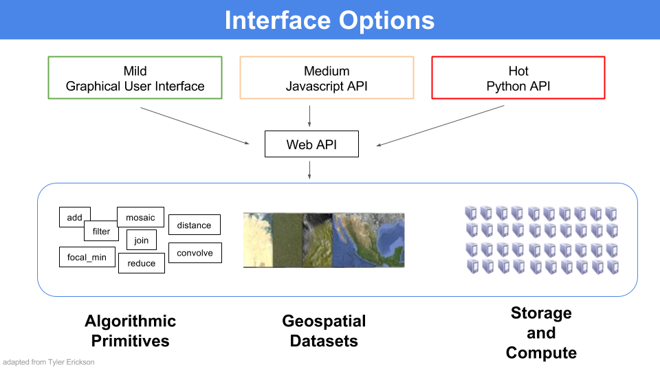

## What is Google Earth Engine?

As Gorelick et al. (2017) write in the new *[Remote Sensing of the Environment](http://www.sciencedirect.com/science/article/pii/S0034425717302900)* article:

> Google Earth Engine is a cloud-based platform for planetary-scale
> geospatial analysis that brings Google's massive computational
> capabilities to bear on a variety of high-impact societal issues
> including deforestation, drought, disaster, disease, food security,
> water management, climate monitoring and environmental protection.

## Why use Google Earth Engine?

Google Earth Engine enables users to compute on petabytes of data on the fly without having the navigate the complexities of cloud-based parallelization. Enhancing inclusive access has spurred the growth of earth observation at scales previously unimaginable.

#### Reason # 1: Planetary-scale science

Since GEE came online, several ground-breaking studies have emerged that
demonstrate the power of bringing large-scale computing to bear on environmental and social problems. The following three examples show the datasets, high-impact publications and web-based data explorers that have been generated from research conducted in GEE.

> Celebrity Use Case 1: Global Forest Watch

The first major use case, known as Global Forest Watch, fundamentally changed our understanding of forest loss on a global scale. - [Global Forest Watch](http://www.globalforestwatch.org/) is a forest monitoring and conservation tool that maps forest gain and loss at a global scale. The underlying dataset, called the Hansen dataset, leverages the whole Landsat archive to dynamically create these maps all over the world back through time. This analysis was only possible because it was created using Google Earth Engine and is the first effort to map algorithms at global scales across entire satellite archives.

Learn more here:

- [High-Resolution Global Maps of 21st-Century Forest Cover Change](http://science.sciencemag.org/content/342/6160/850) original publication in Science by Hansen, et al (2013).

- [Hansen Tutorial for GEE](https://developers.google.com/earth-engine/tutorial_forest_01) Learn GEE by stepping through these beginner-oriented tutorials that engage participants with the dataset.

*Forest loss in Sumatra's Riau province, Indonesia, 2000-2012. Credit: Hansen, Potapov, Moore, Hancher et al., 2013*

> Celebrity Use Case 2: Global Surface Water Occurrence

The Global Surface Water Occurrence Dataset is a Surface Water Explorer developed by the European Commission's Joint Research Centre that maps the temporal and spatial distribution of water on a global scale over the past three decades.

- The original paper published in *Nature* [High-resolution mapping of global surface water and its long-term changes](https://www.nature.com/articles/nature20584)

- [Global Surface Water Tutorial for GEE](https://developers.google.com/earth-engine/tutorial_global_surface_water_01)

- The [Global Surface Water Explorer](https://global-surface-water.appspot.com/) that was published in conjunction with the dataset to allow users to visualize changes in surface water.

- [Data Users Guide](https://storage.googleapis.com/global-surface-water/downloads_ancillary/DataUsersGuidev2.pdf)  

> Celebrity Use Case 3: Global Travel Times

The Oxford Malaria Atlas Project, the European Commission’s Joint Research Centre, and the University of Twente teamed up to create a map of travel times from any point in the world to the nearest urban center. This work can pinpont areas with little access to services in order to inform policy decisions about serv

- The original paper published in *Nature* [A global map of travel time to cities to assess inequalities in accessibility in 2015](https://www.nature.com/articles/nature25181) maps travel time to the nearest densely population area from any spot on the globe.

- The [website](https://map.ox.ac.uk/research-project/accessibility_to_cities/) published in conjunction with the paper

- Some example [GEE scripts](https://code.earthengine.google.com/d52c656d3098b2723b275cc0d113d05e) for visualizing the data

#### Reason # 2: Free cloud processing with built-in functions

Google Earth Engine is designed for cloud-based, parallelized geodata analysis. GEE takes care of all the parallelization on the back end for you. Those operations are called "server-side".

Using GEE, you can call a wide set of functions that have been developed specifically for computing in Earth Engine and apply them over many images simultaneously using Google computational infrastructure. No more downloading and analyzing individuals tiles at a time or stressing about your local storage.

#### Reason # 3: Massive online public data archive

The GEE catalog hosts multiple petabytes of satellite imagery in the cloud, including the entire Landsat mission (!!). Other remote sensing missions represented include Sentinel 1, Sentinel 2, MODIS and others. In addition to earth observing images, GEE also hosts produced datasets for precipitation, population density, topography, land cover and climate. Over 6000 scenes are added daily from active satellite missions.
- [Table 1](http://www.sciencedirect.com/science/article/pii/S0034425717302900) in Gorelick et al. (2017) describes the frequently used datasets,
- the [Google Earth Engine](https://earthengine.google.com/datasets/) website has a general dataset descriptions,
- or you can browse the datasets directly through the [Google Earth Engine API](https://explorer.earthengine.google.com/#index).

 

  

#### Reason # 4: Upload your own data

You can upload your own raster **and** vector data to the platform. You can also recommend datasets from the Javascript API Code Editor window by going the *Help* button on the top right and selecting *Suggest a dataset*.

 

  

#### Reason # 5: Let them take care of version control

GEE will back up on your code in a git repository without you having to think about it. You can share those repositories with other users and view older versions of scripts easily from the Code Editor.

#### Reason # 6: Flexible access through APIS

The GEE development team has worked hard to make GEE easy to access. Google Earth Engine can be accessed through a few different channels, including a non-programming GUI, the JavaScript API and the Python API.

For this class we are using the JavaScript API, but [training materials on accessing GEE using Python](https://developers.google.com/earth-engine/python_install) are now available on the GEE website.

 

  

Still not sure what GEE is for? You can check out the [What is Google Earth Engine?](https://docs.google.com/presentation/d/1hT9q6kWigM1MM3p7IEcvNQlpPvkedW-lgCCrIqbNeis/edit#slide=id.gf251d1053_0_1005) slide deck available from GEE team.

***

## How does it work?

Using the Code Editor, you write commands that are sent as an object to Google for processing in parallel in their cloud (server-side). Users can visualize results from Google in their browser (client-side), including objects like maps, charts or statistical results.

Using one of the APIs, users can filter huge collections of images to dates and areas of their interest, map algorithms over collections of images, apply algorithms to individual images or image collections, and compute aggregate statistics through time and space without having to download a single thing to their computer.

 

  

## Wrap Up

### What are common uses of GEE?

- operate on petabytes of imagery using Google's cloud
- embed outputs in apps
- store, share and version control your code
- import and export your own raster and vector data (assets)
- share your own raster and vector data
- export your analysis

### What is GEE NOT designed for?

- cartography
- heavy duty vector operations
- DIY parallelization. As stated in Gorelick et al. 2017, "The price of liberation from these details [of parallelization] is that the user is unable to influence them.”
