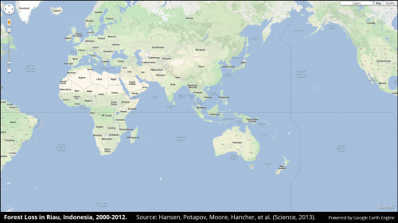

## What is Google Earth Engine & why do I want to use it?

#### **Google Earth Engine is a cloud-based platform for planetary-scale geospatial analysis that brings Google's massive computational capabilities to bear on a variety of high-impact societal issues including deforestation, drought, disaster, disease, food security, water management, climate monitoring and environmental protection.**  - [Gorelick et al., 2017](http://www.sciencedirect.com/science/article/pii/S0034425717302900)

## test 1

 

  

## test 2

Forest loss in Sumatra's Riau province, Indonesia, 2000-2012. Credit: Hansen, Potapov, Moore, Hancher et al., 2013

Read more at: https://phys.org/news/2013-11-global-forest.html#jCp

## How does it work?

3 data science concepts to link with other geohackweek modules
Free massive cloud computing
Archive of standard remote sensing + supporting data in one place
Co-locating computing with data

 

  

## What datasets are available?
## What can I do with GEE?
-
-
## What are the limitations?
- Making pretty maps
- Maybe not awesome for vector manipulations
