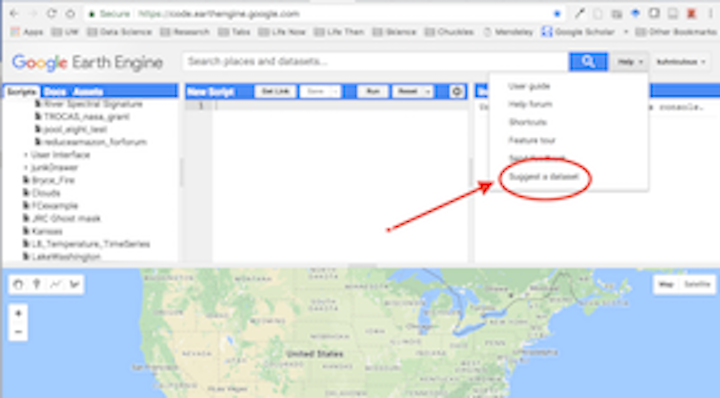

## What is Google Earth Engine?

As Gorelick et al. (2017) write in the 2017  *<a href="http://www.sciencedirect.com/science/article/pii/S0034425717302900" target="_blank">Remote Sensing of the Environment</a>* article:

> Google Earth Engine is a cloud-based platform for planetary-scale
> geospatial analysis that brings Google's massive computational
> capabilities to bear on a variety of high-impact societal issues
> including deforestation, drought, disaster, disease, food security,
> water management, climate monitoring and environmental protection.

## Why use Google Earth Engine?

Google Earth Engine enables users to compute on petabytes of data on the fly without having the navigate the complexities of cloud-based parallelization. Enhancing inclusive access has spurred the growth of earth observation at scales previously unimaginable.

#### Reason # 1: Planetary-scale science

Since GEE came online, several ground-breaking studies have emerged that
demonstrate the power of bringing large-scale computing to bear on environmental and social problems. The following three examples show the datasets, high-impact publications and web-based data explorers that have been generated from research conducted in GEE.

***
> **Celebrity Use Case 1: Global Forest Watch**

Released in 2013, <a href="http://www.globalforestwatch.org/" target="_blank">Global Forest Watch</a> fundamentally changed our understanding of planetary-scale forest loss. This forest monitoring and conservation tool interactively shows forest gain and loss at a global scale. The underlying Hansen deforestation dataset is available in Google Earth Engine and leverages over 3 million Landsat images to map global forest dynamics.

Learn more here:

  - <a href="http://science.sciencemag.org/content/342/6160/850" target="_blank">High-Resolution Global Maps of 21st-Century Forest Cover Change</a> original publication in Science by Hansen, et al (2013).

  - <a href="https://developers.google.com/earth-engine/tutorial_forest_01" target="_blank">Hansen Tutorial for GEE</a> Learn GEE by stepping through these beginner-oriented tutorials that engage participants with the dataset.

*Forest loss in Sumatra's Riau province, Indonesia, 2000-2012. Credit: Hansen, Potapov, Moore, Hancher et al., 2013*

***
> **Celebrity Use Case 2: Global Surface Water Occurrence**

In 2016 the European Commission's Joint Research Centre released a dataset, the Global Surface Water Occurrence dataset, that showed the change intensity of surface water occurrence around the world. In other words, they mapped the loss and gain of water at a global scale since 1984.

  - <a href="https://www.nature.com/articles/nature20584" target="_blank">High-resolution mapping of global surface water and its long-term changes</a> - The original paper published in *Nature*.

  - Online tutorial to play with the data.  <a href="https://developers.google.com/earth-engine/tutorial_global_surface_water_01" target="_blank">Global Surface Water Tutorial for GEE</a>

  - The <a href="https://global-surface-water.appspot.com/" target="_blank">Global Surface Water Data Explorer</a> that was published in conjunction with the dataset to allow users to visualize changes in surface water.

  - A <a href="https://storage.googleapis.com/global-surface-water/downloads_ancillary/DataUsersGuidev2.pdf" target="_blank">Data Users Guide</a> describing the dataset in detail.  

***
> **Celebrity Use Case 3: Global Travel Times**

The Oxford Malaria Atlas Project, the European Commission’s Joint Research Centre, and the University of Twente teamed up to create a map of travel times from any point in the world to the nearest urban center. This work can pinpont areas with little access to services in order to inform public health efforts and policy decisions.

  - <a href="https://www.nature.com/articles/nature25181" target="_blank">A global map of travel time to cities to assess inequalities in accessibility in 2015</a> - The original paper published in *Nature* describing the distribution of travel times to the nearest densely population area from any spot on the globe.

  - The <a href="https://map.ox.ac.uk/research-project/accessibility_to_cities/" target="_blank">website</a> published in conjunction with the paper

  - Some example <a href="https://code.earthengine.google.com/d52c656d3098b2723b275cc0d113d05e" target="_blank">GEE scripts</a> for visualizing the data

***

#### Reason # 2: Free cloud processing with built-in functions

Google Earth Engine is designed for cloud-based, parallelized geospatial data analysis. GEE takes care of all the infrastructure and parellelization decisions on the back end for you. Those operations are called "server-side".

Using GEE, you can call a wide set of functions that have been developed specifically for computing in Earth Engine and apply them over many images simultaneously using Google computational infrastructure. No more downloading and analyzing individuals tiles at a time or stressing about your local storage.

#### Reason # 3: Massive online public data archive

The GEE catalog hosts multiple petabytes of satellite imagery in the cloud, including the entire Landsat mission (!!). Other remote sensing missions represented include Sentinel 1, Sentinel 2, MODIS and others. In addition to earth observing images, GEE also hosts produced datasets for precipitation, population density, topography, land cover and climate. Over 6000 scenes are added daily from active satellite missions.
  - <a href="http://www.sciencedirect.com/science/article/pii/S0034425717302900" target="_blank">Table 1</a> in Gorelick et al. (2017) describes the frequently used datasets.
  - The <a href="https://earthengine.google.com/datasets/" target="_blank">Google Earth Engine</a>
  website has general dataset descriptions.
  - You can browse the datasets directly through the <a href="https://explorer.earthengine.google.com/#index" target="_blank">Google Earth Engine API</a>.

 

  

#### Reason # 4: Upload your own data

You can upload your own raster **and** vector data to the platform. You can also recommend datasets from the Javascript API Code Editor window by going the *Help* button on the top right and selecting *Suggest a dataset*.

 

  

#### Reason # 5: Let them take care of version control

GEE will back up on your code in a git repository without you having to think about it. You can share those repositories with other users and view older versions of scripts easily from the Code Editor.

#### Reason # 6: Flexible access through APIs

The GEE development team has worked hard to make GEE easy to access. Google Earth Engine can be accessed through a few different channels, including a non-programming GUI, the JavaScript API and the Python API.

  - The <a href="https://explorer.earthengine.google.com/#workspace" target="_blank">Google Earth Engine Explorer</a> is great for getting non-specialists on board to view datasets but has limited capabilities for analysis.
  - The JavaScript GUI is a fully built web platform that you make requests through to the main GEE API. The developers have spent years refining this platform to make it easier for users to store, share and version code results, execute tasks and most importantly visualize results on the fly in charts and maps rendered directly in the browser window. They also handle the user authentication just by logging you in through your gmail.
  - The Python API requires users to handle authentication and visualization of results on their end with the benefit of allowing users to more fully customize requests beyond the library of functions natively available in GEE. There is no website you log into to conduct your analysis - code is built from the ground up using workflows that are developed on an individual basis.

For this class we are using the JavaScript API, but <a href="https://developers.google.com/earth-engine/python_install" target="_blank"> training materials on accessing GEE using Python</a> are now available on the GEE website. If you are interested in using the Python API, follow that link for installation instructions or check out an example notebooks <a href="https://github.com/g07kore/Google-Earth-Engine-Python-Examples/blob/master/001_ee_classification_ls8_toa.ipynb " target="_blank">here</a>. The Javascript API has built in map visualization tools already in place, so that is what we use to learn the platform initially.

If you still are not sure what GEE is useful for, you can see more by viewing the <a href="https://docs.google.com/presentation/d/1hT9q6kWigM1MM3p7IEcvNQlpPvkedW-lgCCrIqbNeis/edit#slide=id.gf251d1053_0_1005" target="_blank">What is Google Earth Engine?</a> slide deck available from GEE team.

***

## How does it work?

Using the Code Editor, you write commands that are sent as an object to Google for processing in parallel in their cloud (server-side). Users can visualize results from Google in their browser (client-side), including objects like maps, charts or statistical results.

Using one of the APIs, users can filter huge collections of images to dates and areas of their interest, map algorithms over collections of images, apply algorithms to individual images or image collections, and compute aggregate statistics through time and space without having to download a single thing to their computer.

 

  

## Wrap Up

### What are common uses of GEE?

- operate on petabytes of imagery using Google's cloud
- embed outputs in apps
- store, share and version control your code
- import and export your own raster and vector data (assets)
- share your own raster and vector data
- export your analysis

### What is GEE NOT designed for?

- cartography
- heavy duty vector operations
- DIY parallelization. As stated in Gorelick et al. 2017, "The price of liberation from these details [of parallelization] is that the user is unable to influence them.”
