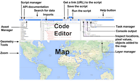
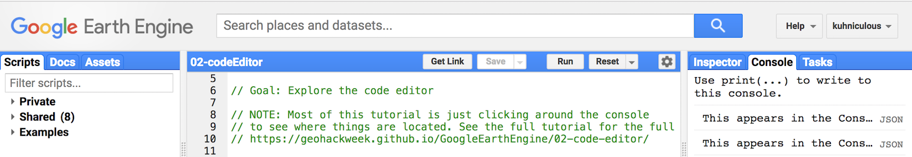
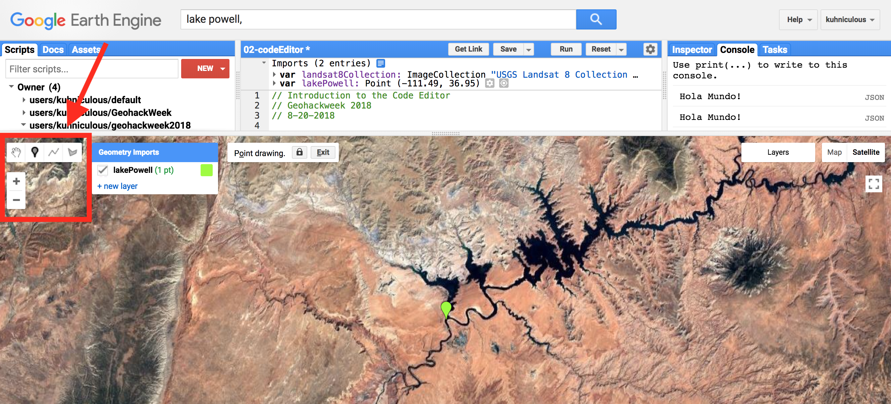
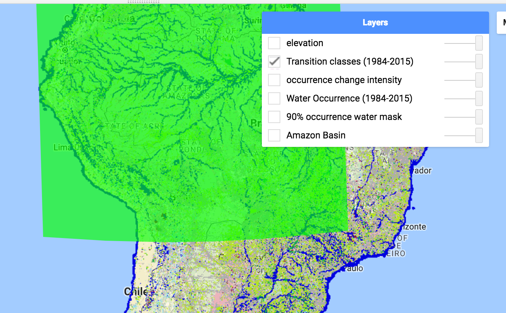
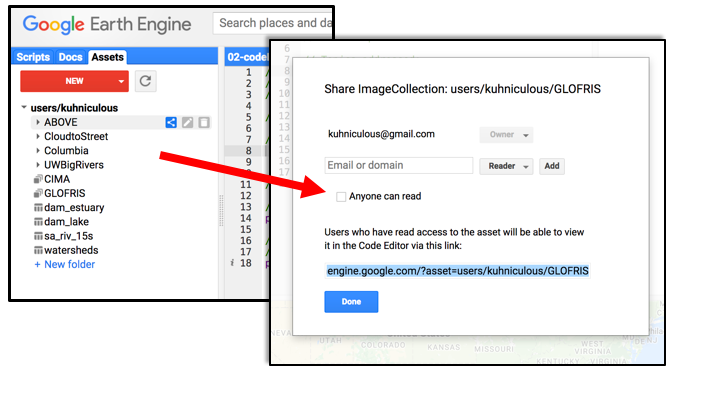

# Code Editor Overview

GEE has an integrated development environment (IDE) called the Code Editor. The Code Editor has number of features to help make programming in this environment easier that we will explore in this tutorial. For an exhaustive description see the <a href="https://developers.google.com/earth-engine/playground#api-reference-docs-tab" target="_blank">Earth Engine Code Editor help page</a>
in the GEE User Guides.  

Link to the full code we used in this lesson:
<a href="https://code.earthengine.google.com/926160c96272a205b91b5ed7b68981ab" target="_blank">https://code.earthengine.google.com/926160c96272a205b91b5ed7b68981ab</a>

# Exercise: Exploring the Code Editor

## 1. Getting Started

**To access the Code Editor, type the following url into your browser: <a href="https://code.earthengine.google.com" target="_blank">https://code.earthengine.google.com</a>** A webpage programming interface like the one below should appear. The diagram below has annotations pointing to many of the functionalities we will cover today.

 

  

#### The JavaScript Code Editor window

Javascript code is typed in this window. The Editor also has a few helper functions, including autocomplete for Earth Engine functions, autocompletion for brackets, etc and some basic underlining and syntax hints.

For example, you can write comments by using a double slash. Type the following into your Editor and click the "Run" button.


// This is just a comment.


#### The Console tab

You can also use `print()` to display things to the console. Type this and click "Run":


// Print something to the console
print("Hola Mundo!");


#### Autosuggestions

The Editor will mark statements as incomplete **`i`** if you write them without a semicolon at the end. You can control these autosuggestions by going to the little grey wheel in the top right of the page and turning them on or off.


print("Hola Mundo!");


 

## 2. Saving & Sharing Scripts

#### Saving Scripts

Save scripts by clicking the **Save** button. To include a commit message, use the dropdown arrow and select "Save with a description."  Messages are stored in the revision history of each saved script.

 

  

*Note: If you didn't make any changes to the script, the* **Save** *button will be greyed out.*

If you look at the top left panel, you can see the script is now saved in your **Scripts** manager. You have three categories of scripts: private, shared and examples. Each script is backed up on Git. If you move your mouse over the name of the script, three icons will pop up that allow you to revert to older versions, rename or delete the script. You can also make folders and click and drags scripts into those directories.

*Note/Warning: If you rename a script, it's revision history disappears.*

#### Sharing Scripts
You can share a static version of scripts by clicking **Get Link**. A url will appear in your browser address field. Share this link to give other people access to your code *as it is.* If you continue to make edits on this code, they will not update in the linked version. This option is useful to share examples and code snapshots with others.

    **Hot Tip: When posted on the help forum, ALWAYS include a link to your code so people can help troubleshoot. Be sure all personal assets you use are publicly shared so the script will run for others.**

#### Joining the shared repository

To collaborate interactively on shared scripts with other users, you can create a shared folder, invite your collaborators and place scripts in that folder. We have created a shared folder for geohackweek2019.

You should have already accessed the shared code repository in the Code Editor with the following steps:

- Join our Google group to access the shared code repository by clicking this link [https://goo.gl/maZwVa](https://goo.gl/maZwVa). Don't worry about posting permissions; we won't  be posting anything.
- Accept the shared repository by clicking this link: <a href="https://code.earthengine.google.com/?accept_repo=users/victorialy/geohackweek2019" target="_blank">https://code.earthengine.google.com/?accept_repo=users/victorialy/geohackweek2019</a>

- In the code editor, go to the **Scripts tab** in the top left panel, scroll down and expand the "Shared" section. A directory called *geohackweek2019* should appear with read-only versions of the full scripts from each episode.

Any updates will be reflected in these versions of the code. Like all GEE scripts, these are version controlled. Read or write permissions for individuals or groups can be set in the Code Editor using the little grey share icon that appears to the right if you move your mouse over the directory name in the *Scripts* tab. You should have read-only access to this repo.

 

## 3. Accessing Datasets from Google's Cloud

#### Search toolbar: Finding datasets and loading them as `ImageCollections`

To query the <a href="https://code.earthengine.google.com/datasets/" target="_blank">GEE data catalog</a>, you can enter key words into the search toolbar at the top of the code editor.

For practice, let's load some imagery into the code editor. We are going to search for and import the **Landsat Top of the Atmosphere (TOA) Reflectance Collection 1 Tier 1** product.
  - To do this, go to the *Search* toolbar and type in **Landsat 8 tier 1 TOA**.
  - Select the dataset - USGS Landsat 8 Collection 1 Tier 1 TOA Reflectance - by clicking on the name. This will bring up the metadata for this data collection. You can confirm you got the correct one because the `ImageCollection ID` should say **LANDSAT/LC08/C01/T1_TOA**
  - Now, click **Import** in this pop out. A new variable (`ImageCollection`) will load into your Code Editor in the "Imports" pane at the top of the code editor.
  - Rename this object "L8_TOA". This object is an `ImageCollection`, which means it is a stack of images. Notice we have to declare this object using *var*. If you click the little blue square icon above the collection, a pop-out will appear showing the code you just created.


var landsat8Collection = ee.ImageCollection("LANDSAT/LC08/C01/T1_TOA")


In order to look at the collection, try to print it just like you did the string.


print(landsat8Collection);


**What happens?**

Earth Engine times out - this means your request is too big, which makes sense as there are thousands of images in the Landsat 8 collection. To get around this, try the following:


print(landsat8Collection.limit(5))


This will show you just the first five images so you can preview the collection. You can see the collection ID, the bands, the features, which are the images in the collection and the properties, which is the metadata.

*Note: The developers are always adding great new functionalities to the GUI so we don't have to code. As a result, sometimes there will be a point-and-click method to do something that can also be accomplished by writing a line or two of code. The 'import' function is a great example of this because you can import a collection using either the "Import" button on the metadata or the 'ImageCollection' command written in JavaScript. Same thing, two ways.*

#### Selecting a study area using Geometry Tools

The geometry drawing tools located on the upper left side of the map viewer can be used to manually create points, line or polygons. We are now going to define a study area using a point we select on the map. We will use the **Geometry Tools** to create that point.

1. Type "Lake Powell, AZ" into the search toolbar and hit enter. This will zoom you to Lake Powell in Arizona, USA.
2. On the left side of the map, click the little marker icon. Your cursor should then turn into crosshairs.
3. Toggle around the map and drop the pin in the center of the lake, which is right next to Lee Vining.
4. Now, go to the Geometry Imports window that has now appeared. In that window, name the point "roi" and change the dropdown from **Geometry** to **FeatureCollection**.

You have now created a new point object and cast it as a `FeatureCollection`. You can now use this  `FeatureCollection` as a way to geographically filter datasets for just your region.

 

  

Having fun? You can further explore how to configure geometries in the <a href="https://geohackweek.github.io/GoogleEarthEngine/05-classify-imagery/" target="_blank">Classifying Imagery</a> section of this tutorial.  

#### Filtering the Image Collection

One of the major benefits of the JavaScript versus Python API is the ability to quickly render on-the-fly geovisualizations of your imagery and outputs. We are now going to visualize one image from the Landsat 8 collection.

We are going to filter the collection down to one image by:

  - filtering it to our study area we defined with a point
  - filtering it down to just one year of images (2018)
  - sorting the images by the overall cloud cover (least cloudy to most cloudy)
  - picking the top image (least cloudy)

Essentially, this allows us to sort through the full Landsat 8 collection and load the best image available for our region of interest for 2018.


// Load Landsat 8 input imagery
var image = ee.Image((landsat8Collection)
    // Filter to get only images under the region of interest.
    .filterBounds(lakePowell)
    // Filter to get only one year of images.
    .filterDate('2018-01-01', '2018-12-31')
    // Select just the optical bands
    .select(['B[1-7]'])
    // Sort by scene cloudiness, ascending.
    .sort('CLOUD_COVER')
    // Get the first (least cloudy) scene.
    .first());



Use a print statement to check out what we just made:


print(image, 'Lake Powell L8 image')


We have now filtered the ENTIRE Landsat 8 archive down to the least cloudy image for our study area in 2018. However, we still need to visualize it, which we will do using the `Map.addLayer` function.

*Note: Not sure what this function does? Search for it in the* **Docs** *tab to learn the arguments.*


Map.addLayer(image,{},  'L8 Image');


#### Layer Manager

That doesn't look so great. Let's actually define what bands to use and fill in some other visualization parameters using the layer manager. We will use reflectance in the visible range from the red (Band 4), the green (Band 3) and the blue (Band 2) to make a true color image.  We can use prior knowledge to make a nice image:


Map.addLayer(image, {bands: ['B4', 'B3', 'B2'], max: 0.5, gamma: 2}, 'Better L8 Image');


More often then not, though, you may not know the optimal min, max and stretch. This is why they added the **Layer Manager** tool which can be found in the upper right hand corner of the map. This toolbar will allow you to click layers on and off as well as adjust their transparency and interactively configure each layer's visualization parameters. You can use this tool to figure out what parameters to pass to the `Map.addLayer`.

 

  

You can also toggle between the **Map** or **Satellite** buttons in the top right of the map panel to change the baselayer.

For more on image visualization, see the <a href="https://developers.google.com/earth-engine/image_visualization" target="_blank">GEE Visualization Guide</a> or the <a href="https://developers.google.com/earth-engine/tutorial_api_02" target="_blank">GEE Visualization tutorial</a>

#### Inspector Tab

Another way you can inspect and explore your image is through the inspector tool. The Inspector console allows you to interactively query the map. If you have imagery loaded, it will give you information about that imagery at the point you clicked as well.

In the upper right, switch to the **Inspector** tab and click on the map where there is land. Now click where there is water. Toggle the between the graph and the list of values.

## STOP & PLAY

On your own, play with the stretch parameters and use the Inspector to explore the map, clicking between land, bare earth, forest and water.

If you already did that, you can play with dropping the point somewhere else and looking at a different image of your favorite place.

You could also change the dates to look at a winter time image and see how the reflectance changes when there is snow on the ground.

## 4. Getting Help

There are many entry points for getting help tucked into the Code Editor. Familiarizing yourself with these tools can help soften the learning curve.

#### API reference (Docs tab)

Next to the **Scripts** tab is the **Docs** tab, which has the complete, searchable JavaScript API documentation for every function and call. The documentation is organized by GEE data type. Each data type has a specific set of functions that can be applied to it.

#### Help Button

The **Help** button is a gateway to many resources, including links to:

 - the <a href="https://developers.google.com/earth-engine/" target="_blank">**Developers Guide**</a>
for official GEE tutorials, reference and guides. This is the first place I go when I need to look up how to write some code.

 - the **Help Forum** where you can post questions and get answers. If I can't find a guide for my specific question on the GEE Guides, I then go search for key words from my problem/question on the forum. Since people share links to their codes, you can often find great examples of solutions here.

 -  <a href="https://developers.google.com/earth-engine/tutorials" target="_blank">Existing tutorials</a> and the <a href="https://developers.google.com/earth-engine/edu" target="_blank">Earth Engine for Higher Education resources</a> written by the GEE team and others (even some in Japanese!)

 - A list of keyboard shortcuts

 - links to the **Suggest a Dataset** page

#### Examples in the **Shared Scripts**

A final place you can get help is by scrolling down and looking at the examples housed in the **Shared Scripts** in the **Scripts** tab.  

 

## 5. Importing & Exporting Your Own Assets

#### Importing Images and Tables
Besides using all of Google's amazing archives, users can also import their own data as either images (rasters) or tables (vectors). The **Assets** tab on the left is where you can import, share and manage these own assets. You can upload images or tables (vector data) here.

When posting on the forum, make sure you check the "Anyone Can Read" box on the sharing assets pop-out so folks on the forum can all run your code. If you have a private asset and you don't make it public, other people will not be able to run your code. If you don't want to share your private data, you can create a dummy example to share on the forums using hand drawn points or polygons.

 

  

For an example script that uses imported data, see <a href="https://geohackweek.github.io/GoogleEarthEngine/06-time-series/" target="_blank">Episode 06 Time Series</a>. For detailed instructions from Google on uploading, sharing and managing assets, see the <a href="https://developers.google.com/earth-engine/asset_manager" target="_blank">Assets Manager page</a> on the GEE website .

#### Exporting & the Tasks Tab
Instead of printing to the console, for larger tasks you may want to just export the outputs to your Google Drive or Cloud Storage using the `Export` functions in your code. When run, these generate a new task in the `Task` tab in the upper right panel. You will need to then "Run" this task in order to actually start the export. Once you start an export task, you will be prompted to enter details about the resolution, size, format and destination if you did not include this in your code. You can hover your mouse over the task and click the "?" icon to see the status and also to get the task number. If your task isn't executing, you can share this number as a reference on the developers forum.

We will do an example table export in <a href="https://geohackweek.github.io/GoogleEarthEngine/03-load-imagery/" target="_blank">Episode 3: Load Imagery</a> of this tutorial.

For detailed instructions on exports, see the <a href="https://developers.google.com/earth-engine/exporting" target="_blank">Exporting Data page</a> on the GEE website. We will also have small export examples in subsequent modules of this tutorial.

 
 

### Enjoy!!!
