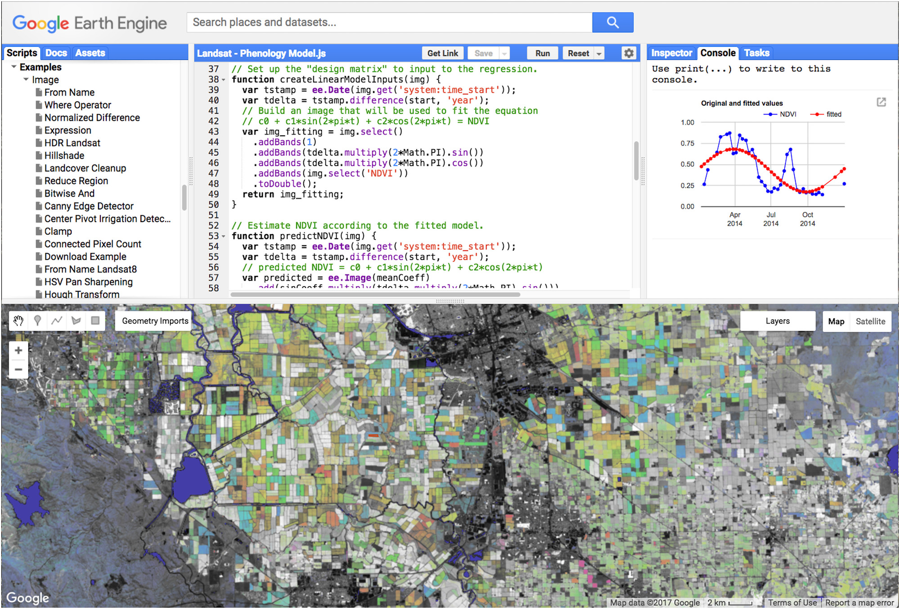

## Code Editor: Overview

The Earth Engine JavaScript API has a integrated development environment (IDE) designed to make computing in GEE easy for users. This IDE is called the Code Editor. In this tutorial, we will go over many of the functionalities described identified in this figure, but for a more exhaustive description see the [Earth Engine Code Editor help page](https://developers.google.com/earth-engine/playground#api-reference-docs-tab) in the GEE User Guides.  

## Exercise: Exploring the Code Editor

## Coding things

The Code Editor has number of features to help make programming in this environment easier. To access the Code Editor, type the following url into your browser: [code.earthengine.google.com](code.earthengine.google.com)

A  webpage like the following (without annotations) should appear:

 

  

### Search toolbar

To query the [GEE data catalog](https://earthengine.google.com/datasets/), you can enter key words into the search toolbar. You can also use the search toolbar to locate places in geographic space. If you select a dataset, you can click **Import** to load it into the Code Editor.

### The JavaScript Editor

Javascript code is typed in this window. The Editor also has a few helper functions, including autocomplete for Earth Engine functions, autocompletion for brackets, etc and some basic underlining and syntax hints.

For example, you can write comments by using a double slash. Type the following into your Editor and click the "Run" button.


// This is just a comment.


## The Console

You can also use `print()` to display things to the console. Type this and click "Run":


print("This appears in the Console tab");


### Autosuggestions

The Editor will mark statements as incomplete ('i') if you write them without a semicolon at the end. You can control these autosuggestions by going to the little grey wheel in the top right of the page and turning them on or off.


print("This appears in the Console tab")


## Saving, Sharing, Importing and Exporting

### Saving & Sharing

Now that you have written your first few lines of JavaScript, you can share this by clicking the "Save" button, naming the script file and then clicking "Get Link". A url will appear in your browser address field. Share this link to give other people access to your code.

 

  

**Hot Tip: When posted on the help forum, ALWAYS include a link to your code so people can help troubleshoot.**

### Scripts

If you look to the left, you can see the script is now saved in your **Scripts** manager. You have three categories of scripts: private, shared and examples. Each script is backed up on Git. If you move your  mouse over the name of the script, three icons will pop up that allow you to revert to older versions, rename or delete the script. You can also make folders and move scripts by clicking and dragging them.

A second way to share scripts would be to create a shared folder, invite your collaborators and place scripts in that folder.

### Assets

The **Assets** tab on the left is where you can import, share and manage your own assets. You can upload images or tables (vector data) here.

When posting on the forum, make sure you check the "Anyone Can Read" box on the sharing assets pop-out so folks on the forum can all see your code. If you have a private asset and you don't make it public, other people will not be able to run your code.

 

  

For detailed instructions on uploading, sharing and managing assets, see the [Assets Manager page](https://developers.google.com/earth-engine/asset_manager) on the GEE website .

### Exporting & the Tasks Tab
Instead of printing to the console, for larger tasks you may want to just export the outputs to your Google Drive or Cloud Storage. Once you start an export task, you will be prompted to enter details about the resolution, size, format and destination. You can hover your mouse over the task and click the "?" icon to see the status and also to get the task number. If your task isn't executing, you can share this number as a reference on the developers forum.

For detailed instructions on exports, see the [Exporting Data page](https://developers.google.com/earth-engine/exporting) on the GEE website.  

## Mapping things

One of the major benefits of the JavaScript versus Python API is the ability to quickly render on-the-fly geovisualizations of your imagery and outputs. The mapping window has several useful functionalities described below.

### Map viewer

Once we load imagery into the Code Editor and add it to the map later in this tutorial, results will appear in the Map window. You can also select either "Map" or "Satellite" to change the baselayer.

### Inspector Tab

In the upper right, switch to the inspector console and click anywhere on the map. The Inspector console allows you to interactively query the map. If you have imagery loaded, it will give you information about that imagery at the point you clicked.

### Layer Manager

Once we have layers added later in the tutorial, a "Layers" toolbar will appear in the upper right hand corner of the map (like below). This toolbar will allow you to click layers on and off as well as adjust their transparency and interactively configure each layer's visualization parameters.  

 

  

### Geometry Tools

Besides importing vector data through the assets tab, you can also use the geometry drawing tools located on the upper left side of the map viewer to manually create points, line or polygons.

We will explore how to configure geometries in the [Classifying Imagery](https://geohackweek.github.io/GoogleEarthEngine/04-classify-imagery/) section of this tutorial.  

## Getting Help

There are many entry points for getting help tucked into the Code Editor. Familiarizing yourself with these tools can help soften the learning curve.

### API reference (Docs tab)

Next to the **Scripts** tab is the **Docs** tab, which has the complete, searchable JavaScript API documentation for every function and call.

### Help Button

The **Help** button is a gateway to many resources, including links to:

 - the **Developers Guide** for official GEE tutorials, reference and guides. This is the first place I go when I need to look up how to write some code.

 - the developers **Help Forum** where you can post questions and get answers. If I can't find a guide for my specific question on the GEE Guides, I then go search for key words from my problem/question on the forum. Since people share links to their codes, you can often find great examples of solutions here.

 - A list of keyboard shortcuts

 - links to the **Suggest a Dataset** page

### Examples in the **Shared Scripts**

A final place you can get help is by scrolling down and looking at the examples housed in the **Shared Scripts** in the **Scripts** tab.  

## Enjoy!!!

 

  

from Gorelick et. al. (2017)

Link to the full code we used in this lesson: [https://code.earthengine.google.com/be0541e89d66904395656def37ed8932](https://code.earthengine.google.com/be0541e89d66904395656def37ed8932)
