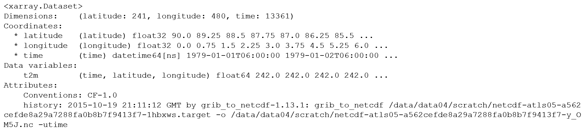

### What is xarray?

* originally developed by employees (Stephan Hoyer, Alex Kleeman and Eugene Brevdo) at [The Climate Corporation](https://climate.com/)
* xaray extends some of the core functionality of the Pandas library:
    * operations over _named_ dimensions
    * selection by label instead of integer location
    * powerful _groupby_ functionality
    * database-like joins

### When to use xarray:

* if your data are multidimensional (e.g. climate data: x, y, z, time)
* if your data are structured on a regular grid
* if you can represent your data in netCDF format

### Basic xarray data structures:
* NetCDF forms the basis of the xarray data structure
* two main data structures are the `DataArray` and the `Dataset`

#### `DataArray`
* the `DataArray` is xarray's implementation of a labeled, multi-dimensional array
* the `DataArray` has these key properties:
  * `data`: N-dimensional array (NumPy or dask) holding the array's values,
  * `dims`: dimension names for each axis,
  * `coords`: dictionary-like container of arrays that label each point, and
  * `attrs`: ordered dictionary holding metadata

   

   
* dimensions (x, y, time); variables (temp, precip); coords (lat, long); attributes

### `Dataset`
* xarray's multi-dimensional equivalent of a Pandas `DataFrame`
* dict-like container of DataArray objects with aligned dimensions
* Datasets have these key properties:
  * `dims`: dictionary mapping from dimension names to the fixed length of each dimension,
  * `data_vars`: dict-like container of `DataArrays` corresponding to data variables,
  * `coords`: dictionary-like container of `DataArrays` intended to label points used in data_vars
  * `attrs`: ordered dictionary holding metadata

### begin by importing the xarray library


import xarray as xr


### Open the dataset

First we [open](http://xarray.pydata.org/en/stable/generated/xarray.open_dataset.html) the data and load it into a `Dataset`. (Note: the choice of engine depends on the format of the netCDF file. See our [dataset description](../00-datasets) lesson).

~~~
ds = xr.open_dataset('../data/airtemp_global.nc')
~~~
{: .python}

(__NOTE__: here and elsewhere, replace `<rootDir>` with the full path to your own data directory)

You'll notice this seemed to go very fast. That is because this step does not actually ask Python to read the data into memory. Rather, Python is just scanning the contents of the file. This is called _lazy loading_.

## `Dataset` Properties

Next we will ask xarray to display some of the [parameters](http://xarray.pydata.org/en/stable/generated/xarray.Dataset.html) of the `Dataset`. To do this simply return the contents of the `Dataset` variable name:

~~~
ds
~~~
{: .python}

 

 

> ## Displaying `Dataset` properties
> Try looking up the coordinates (coords), attributes (attrs) and data variables (data_vars) for our existing dataset.
> Look at the output and think about what this tells us about our sample dataset.
{: .challenge}

### Extracting `DataArrays` from a `Dataset`

We have queried the dataset details about our `Datset` dimensions, coordinates and attributes. Next we will look at the variable data contained within the dataset. In the graphic above, there are two variables (temperature and precipitation). As described above, xarray stores these observations as a `DataArray`, which is similar to a conventional array you would find in numpy or matlab.

Extracting a `DataArray` for processing is simple. From the `Dataset` metadata shown above, notice that the name of the climate variable is 't2m' (2 meter air temperature). Suppose we want to extract that array for processing and store it to a new variable called `temperature`:

~~~
temperature = ds['t2m']
~~~
{: .python}

Now, take a look at the contents of the `temperature` variable. Note that the associated coordinates and attributes get carried along for the ride. Also note that we are still not reading any data into memory.
