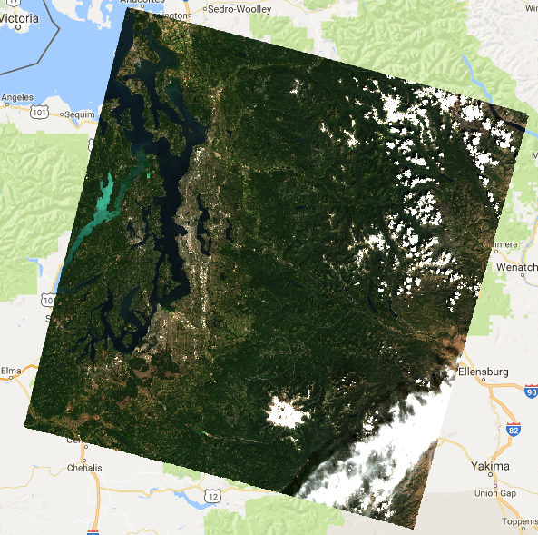
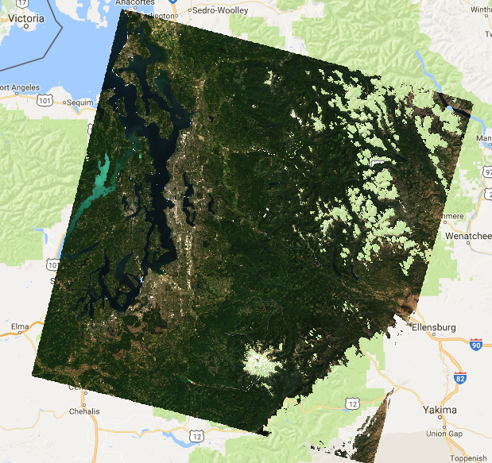
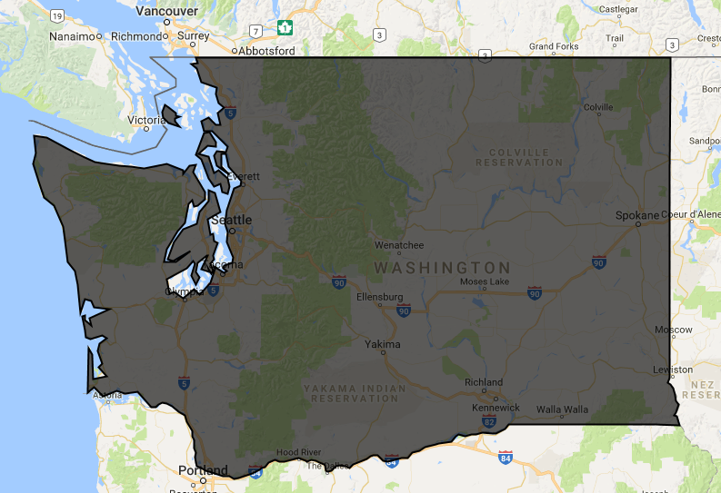
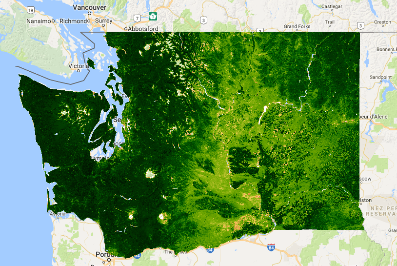
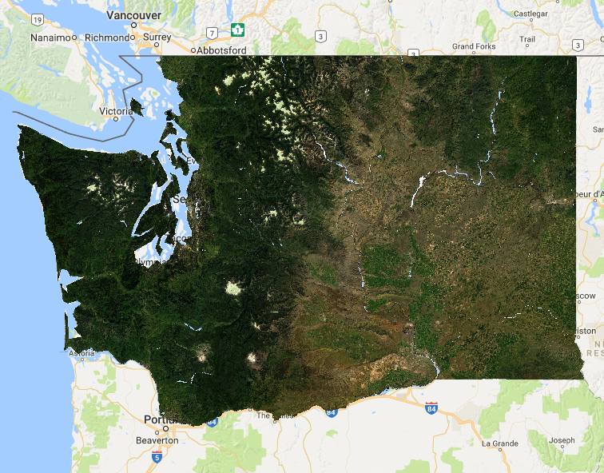

## Single Image


// load an image by name (collection Id + image id)
var image = ee.Image('LANDSAT/LC8_SR/LC80460272016209')

// view the image metadata in the Console
print(image);

// add the image to the map, setting the bands to use for RGB
Map.addLayer(image, {bands: ['B4', 'B3', 'B2'], min: 0, max: 2000}, 'L8 SR');


 

  

### Mask clouds


// mask pixels with clouds and cloud shadows
// surface reflectance products come with a 'cfmask' layer
// 0 = clear, 1 = water, 2 = cloud shadows, 3 = snow, 4 = clouds
var cfmask = image.select('cfmask');  // extract the 'cfmask' band   
var imageMasked = image.updateMask(cfmask.neq(2)).updateMask(cfmask.neq(4));  

// visualize the masked image
Map.addLayer(imageMasked, {bands: ['B4', 'B3', 'B2'], min: 0, max: 2000}, 'clouds masked');


 

  

## Mosaicking Multiple Images

### Load Vector Boundary


// load a polygon boundary (a shapefile previously uploaded to a user 'Assets' folder)
var boundary = ee.FeatureCollection('users/jdeines/vector/examples/WA');
print(boundary);
Map.addLayer(boundary, {}, 'WA');


 

  

### Load an image collection based on filter criteria


var cWA = ee.ImageCollection('LANDSAT/LC8_SR')
          .filterBounds(boundary)
          .filterDate('2016-01-01', '2016-12-31');
print(cWA);


### Mapping functions: mask clouds, calculate new band

#### Mask clouds over an image collection


// create function to mask clouds, cloud shadows, snow
var maskClouds = function(img){
  var cfmask = img.select('cfmask');    
  return img.updateMask(cfmask.eq(0));   // keep clear (0) pixels
};

// use "map" to apply the function to each image in the collection
var cMasked = cWA.map(maskClouds);


#### Calculate NDVI and Add Band to Images


// Calculate NDVI and add as a new band
// use "map" to apply an anonymous function to each image
var cNDVI = cMasked.map(function(img){
  // add a NDVI band to each image
  return img.addBands(img.normalizedDifference(['B5','B4']).rename('NDVI'));
});


### Create an Image Composite from Collection


// Make a "greenest pixel" composite for WA state
var greenest = cNDVI.qualityMosaic('NDVI').clip(boundary);
print(greenest);

// Visualize NDVI
var ndviPalette = ['FFFFFF', 'CE7E45', 'DF923D', 'F1B555', 'FCD163', '99B718',
               '74A901', '66A000', '529400', '3E8601', '207401', '056201',
               '004C00', '023B01', '012E01', '011D01', '011301'];
Map.addLayer(greenest.select('NDVI'), 
            {min:0.1, max: 1, palette: ndviPalette}, 'ndvi');


 

  


// Visualize true color composite
Map.addLayer(greenest, {bands: ['B4', 'B3', 'B2'], min: 0, max: 2000}, 'WA tcc', false);


 

  

## Exporting Composite Images


// select only the ndvi band
var ndvi = greenest.select('NDVI');

// Export to your folder on Google Drive 
// (note: need to hit 'Run' in the task tab in upper right panel) 
Export.image.toDrive({
  image: ndvi,
  description: 'Washington_NDVI_2016',
  scale: 30,
  region: boundary.geometry().bounds(), // .geometry().bounds() needed for multipolygon
  crs: 'EPSG:5070',
  folder: 'GEE_geohackweek',
  maxPixels: 2000000000
});

// Export to your ASSET folder 
// (note: need to hit 'Run' in the task tab in upper right panel) 
Export.image.toAsset({
  image: ndvi,
  description: 'Washington_NDVI_2016_asset',
  assetId: 'users/yourname/2016_WA_ndvi',
  scale: 30,
  region: boundary.geometry().bounds(),
  pyramidingPolicy: {'.default':'mean'}, // use {'.default':'sample'} for discrete data
  maxPixels: 2000000000
});


