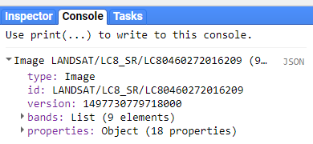

Get access to the shared code repository in the code editor:

- Join our Google group by clicking this link (don't worry about posting permissions; we won't  be posting anything): (https://goo.gl/maZwVa)
- Accept the shared repository by clicking this link: (https://code.earthengine.google.com/?accept_repo=geohackweek2017)

Link to a static version of the full script used in this module:
(https://code.earthengine.google.com/37ca6df552bd8c19488273ff9d4f444b)

## Load a Satellite Image
In Google Earth Engine (GEE), raster data are called `Images`. Each image has 1 or more named bands as well as metadata stored as properties. More information on Images can be found [here in the GEE Developer's Guide](https://developers.google.com/earth-engine/image_overview).

Here, we will load a specific image from the Landsat 8 Surface Reflectance product ([described here in the data catalog](https://code.earthengine.google.com/dataset/LANDSAT/LC8_SR)). These satellite images have already been processed to surface reflectance values using standard algorithms by the USGS and come with a cloud mask band ('cfmask').

Note that each individual image in GEE has an Image ID. We will load an image over Seattle from July 28, 2016. The image ID is LC80460272016209. Landsat image ID's follow this pattern: **image collection + path number + row number + year + julian day**, or in this case, LC8 + 046 + 027 + 2016 + 209. Images from other data products have similar logical naming patterns.

We can look at the image we've loaded in two ways:

* print the image, which displays image metadata in the console (upper right panel)
* add the image to the map panel, specifying how we'd like to visualize it


// load an image by name (collection Id + image id)
var image = ee.Image('LANDSAT/LC8_SR/LC80460272016209')

// view the image metadata in the Console
print(image);


 

  


// add the image to the map, setting the bands to use for RGB
Map.centerObject(image, 8); // specify map location and zoom level, if desired
Map.addLayer(image, {bands: ['B4', 'B3', 'B2'], min: 0, max: 2000}, 'L8 SR');


Note the arguments for Map.addLayer() are Map.addLayer(eeObject, dictionary of visualization parameters, layer name...). These are described in the `Map` section of the Docs panel.

 

  

### Manipulate Image Data: Mask clouds
The `Docs` tab in the upper left panel provides a description of all the available functions for image manipulation under the `ee.Image` dropdown menu. There are a lot, including mathematical and boolean operators, convolutions and focal statistics, and spectral transformations and analyses of spatial texture. Browse the list, or read about general operations available in the [GEE Developer's Guide "Image Overview"" section](https://developers.google.com/earth-engine/image_overview).

Here, we'll make use of the `cfmask` cloud band provided with the SR products to mask pixels with clouds and cloud shadows. We will mask pixels in the image based on the value of cfmask.


// mask pixels with clouds and cloud shadows
// surface reflectance products come with a 'cfmask' layer
// 0 = clear, 1 = water, 2 = cloud shadows, 3 = snow, 4 = clouds

// extract the 'cfmask' band, and use this band to mask all image bands  
var cfmask = image.select('cfmask');  
// keep pixels not equal (neq) to 2 or 4
var imageMasked = image.updateMask(cfmask.neq(2)).updateMask(cfmask.neq(4));  

// visualize the masked image
Map.addLayer(imageMasked, {bands: ['B4', 'B3', 'B2'], min: 0, max: 2000}, 'clouds masked');


 

  

## Mosaicking Multiple Images: Image Collections
A stack or time series of images are called `Image Collections`. Each data source available on GEE has it's own Image Collection and ID (for example, the [Landsat 5 SR collection](https://code.earthengine.google.com/dataset/LANDSAT/LT5_SR), the [GRIDMET meteorological data collection](https://code.earthengine.google.com/dataset/IDAHO_EPSCOR/GRIDMET)). You can also create image collections from individual images or merge existing collections. More information on Image Collections can be found [here in the GEE Developer's Guide](https://developers.google.com/earth-engine/ic_creating).

In order to generate images that cover large spatial areas and to fill in image gaps due to clouds, etc, we can load a full `ImageCollection` but filter the collection to return only the time periods or spatial locations that are of interest. There are shortcut filters for those commonly used (imageCollection.filterDate(), imageCollection.filterBounds()...), but any filter in the `ee.Filter()` section of the Docs tab can be used. Read more about [filters on the Developer's Guide](https://developers.google.com/earth-engine/ic_filtering).

### Load Vector Boundary
We'll work on making a composite satellite image for the state of Washington. The easiest way to filter for an irregular location without having to identify the paths and rows of the satellite image tiles is to use a vector polygon.

There are three ways to use vector data in GEE:

* [Upload a shapefile](https://developers.google.com/earth-engine/importing) to your personal **Asset** folder in the top left panel. You can set sharing permissions on these as needed.
* Import an existing [Google Fusion Table](https://support.google.com/fusiontables#topic=1652595), or [create your own](https://fusiontables.google.com/data?dsrcid=implicit) fusion table from a KML in WGS84.  Each fusion table has a unique Id (File > About this table) that can be used to load it into GEE. You also need to set sharing permissions similar to other items in your Google Drive if you want others to be able to access your fusion table. GEE only recently added the Asset option, so you may see folks still using fusion tables in the forums, etc. If you have the choice, I'd use an asset. We use a fusion table in the [Spatial and Temporal Reducers Module](https://geohackweek.github.io/GoogleEarthEngine/04-reducers/).
* Manually draw points, lines, and polygons using the geometry tools in the code editor. We do this in the [Classify Imagery Module](https://geohackweek.github.io/GoogleEarthEngine/05-classify-imagery/).

Here, we will use a vector asset loaded to the instructor's personal asset folder and made publicly available through the sharing menu. The file location is 'users/jdeines/vector/examples/WA'. When you upload a vector file (called a table) to your asset folder using the "New" button under the **Assets tab** in the upper left panel of the code editor, it will be stored in 'users/yourUserName/filename' unless you create new folders within your Assets space. For more on importing vector files, see the [Developer's Guide section on Importing Table Data](https://developers.google.com/earth-engine/importing). **Tip**: when uploading a shapefile, you need to select all associated files (.dbf, .shx, .prf, etc) or upload a zipped file containing only one shapefile.

In order to load a vector file from your Assets into your workspace, we need to use the "filepath" and cast it to a `ee.FeatureCollection` data type. Read more here under ["Managing Assets" in the Developer's Guide](https://developers.google.com/earth-engine/asset_manager#importing-assets-to-your-script).


// load a polygon boundary (a shapefile previously uploaded to a user 'Assets' folder)
var boundary = ee.FeatureCollection('users/jdeines/vector/examples/WA');
print(boundary);
Map.addLayer(boundary, {}, 'WA');


 

  

### Load an image collection based on filter criteria
Here, we are selecting all imagery in the [Landsat 8 surface reflection collection](https://code.earthengine.google.com/dataset/LANDSAT/LC8_SR) (image collection IDs are found in the "Search" toolbar at the top of the code editor or through searcing the [data archive](https://code.earthengine.google.com/datasets/)) for the year 2016 that overlies the Washington state vector polygon we loaded above as the variable "boundary".


// load all Landsat 8 SR image within polygon boundary for 2016
var cWA = ee.ImageCollection('LANDSAT/LC8_SR')
          .filterBounds(boundary)
          .filterDate('2016-01-01', '2016-12-31');
print(cWA);


### Mapping functions: mask clouds, calculate new band
As you can see by browsing the `Docs` tab in the upper left panel of the code editor, there are GEE functions specific to both the `Image` and `ImageCollection` data types. Often, we want to use a function specific to images on all images in an image collection. To do so, we need to essentially "loop" through each image in the image collection. In GEE, "loops" are accomplished with the .map() function. **Avoid actual loops at all costs.** Using imageCollection.map() sends the operation to Google's servers for distributed runs. Loops implemented in typical JavaScript fashion bring the operation into the browser, and won't work.

More information about mapping functions over image collections can be found [here in the Developer's Guide](https://developers.google.com/earth-engine/ic_mapping).

The .map() concept applies to `featureCollections` as well - to apply a function to each feature in a collection, we map that function across the featureCollection with featureCollection.map(). See ["Mapping over a Feature Collection"](https://developers.google.com/earth-engine/feature_collection_mapping) in the Developer's Guide.

#### Mask clouds over an image collection
Here, we explicitly define a new function called "maskClouds" and apply it to each image in the imageCollection by using `imageCollection.map()`. Functions need to explicitly **return** the final output.


// create function to mask clouds, cloud shadows, snow
var maskClouds = function(img){
  var cfmask = img.select('cfmask');    
  return img.updateMask(cfmask.eq(0));   // keep clear (0) pixels
};

// use "map" to apply the function to each image in the collection
var cMasked = cWA.map(maskClouds);


#### Calculate NDVI and Add Band to Images
You can also map **anonymous functions** over image collections instead of explicitly defining new functions. In the example below, we apply an anonymous function in which each image in the collection is referred to by the 'img' variable name.


// Calculate NDVI and add as a new band
// use "map" to apply an anonymous function to each image
var cNDVI = cMasked.map(function(img){
  // add a NDVI band to each image
  return img.addBands(img.normalizedDifference(['B5','B4']).rename('NDVI'));
});


### Image Mosaics: Create an Image Composite from Collection
We now need to assemble the image collection to create one continuous image across Washington state. There are several mosaicking/compositing options available, from simple maximum value composites (`imageCollection.max()`) and straightforward mosaics with the most recent image on top (`imageCollection.mosaic()`). The [Compositing and Mosaicking page on the Developer's Guide](https://developers.google.com/earth-engine/ic_composite_mosaic) provides examples of these.

Here, we will use the `imageCollection.qualityMosaic()` function. By prioritizing the image to use based on one specific band, this method ensures that the values across all bands are taken from the same image. Each pixel gets assigned the values from the image with the highest value of the desired band.

We will use this to make a "greenest pixel composite" for Washington state based on the NDVI band we just calculated. The final composite image will retain all bands in the input (unless we were to specify otherwise). Each pixel in the composite image could potentially come from imagery acquired on different dates, but all bands within each pixel are from the same image. In general, this provides a snapshot of the landscape at the peak of the growing season, regardless of the phenological timing within the year.


// Make a "greenest pixel" composite for WA state
var greenest = cNDVI.qualityMosaic('NDVI').clip(boundary);
print(greenest);

// Visualize NDVI
var ndviPalette = ['FFFFFF', 'CE7E45', 'DF923D', 'F1B555', 'FCD163', '99B718',
               '74A901', '66A000', '529400', '3E8601', '207401', '056201',
               '004C00', '023B01', '012E01', '011D01', '011301'];
Map.addLayer(greenest.select('NDVI'),
            {min:0.1, max: 1, palette: ndviPalette}, 'ndvi');


Annual maximum NDVI across Washington:

 

  

We can also use this composite image to visualize a true color composite using the RGB bands as we did above:


// Visualize true color composite
Map.addLayer(greenest, {bands: ['B4', 'B3', 'B2'], min: 0, max: 2000}, 'WA tcc', false);


 

  

## Exporting Composite Images
Users can export the results of their image manipulations to their GEE Asset folder for downstream use within GEE or to their personal Google Drive or Google Cloud Storage accounts. Here, we export a single-band image of annual maximum NDVI for Washington state. Examples are provided for asset and Google Drive exports. More information can be found [here in the Developers Guide](https://developers.google.com/earth-engine/exporting).

In the JavaScript API, all exports are sent to the 'Tasks' tab in the upper right panel. To prevent users from inadvertently overwhelming the system with gratuitous, accidental tasks, you need to explicitly run individual exports from the 'Tasks' tab. YOu can change filenames and other parameters here if necessary, or hard code these into your script.

When exporting to Google Drive, GEE will find the named folder specified and does not need the full file path. If this folder does not yet exist, it will create it for you in your Drive.


// select only the ndvi band
var ndvi = greenest.select('NDVI');

// Export to your folder on Google Drive
// (note: need to hit 'Run' in the task tab in upper right panel)
Export.image.toDrive({
  image: ndvi,
  description: 'Washington_NDVI_2016',
  scale: 30,
  region: boundary.geometry().bounds(), // .geometry().bounds() needed for multipolygon
  crs: 'EPSG:5070',
  folder: 'GEE_geohackweek',
  maxPixels: 2000000000
});

// Export to your ASSET folder
// (note: need to hit 'Run' in the task tab in upper right panel)
Export.image.toAsset({
  image: ndvi,
  description: 'Washington_NDVI_2016_asset',
  assetId: 'users/yourname/2016_WA_ndvi',    // can add subfolders if needed
  scale: 30,
  region: boundary.geometry().bounds(),
  pyramidingPolicy: {'.default':'mean'}, // use {'.default':'sample'} for discrete data
  maxPixels: 2000000000
});


Link to a static version of the full script used in this module:
(https://code.earthengine.google.com/37ca6df552bd8c19488273ff9d4f444b)
