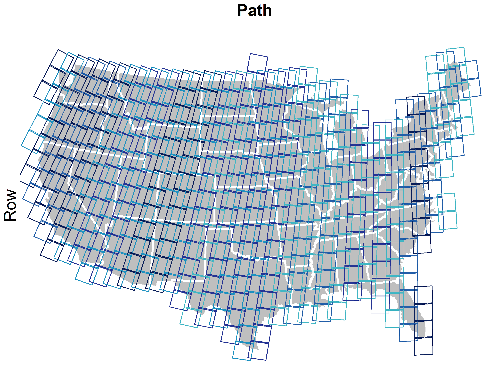
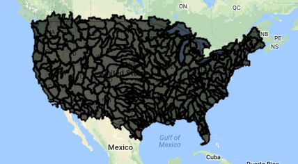
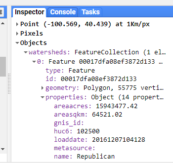
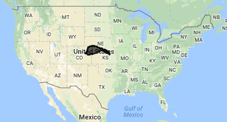
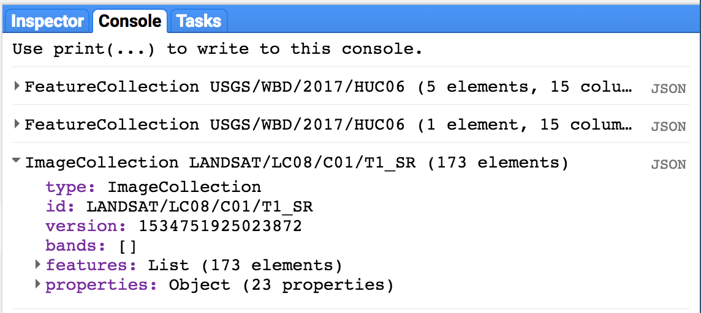
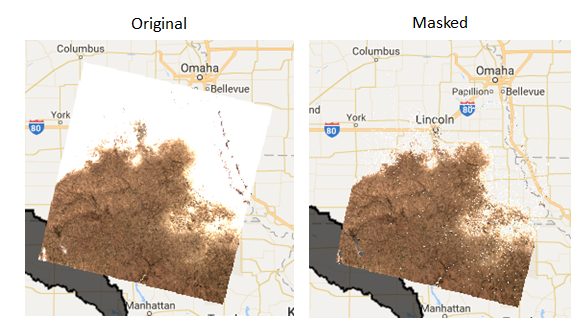
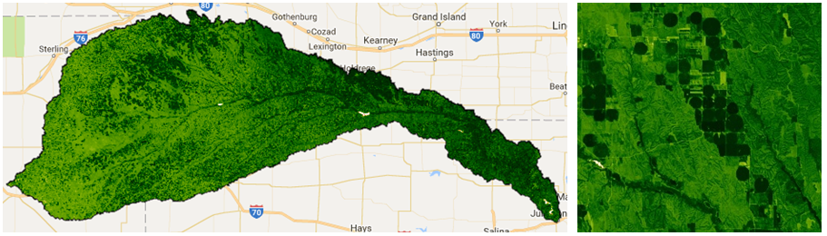
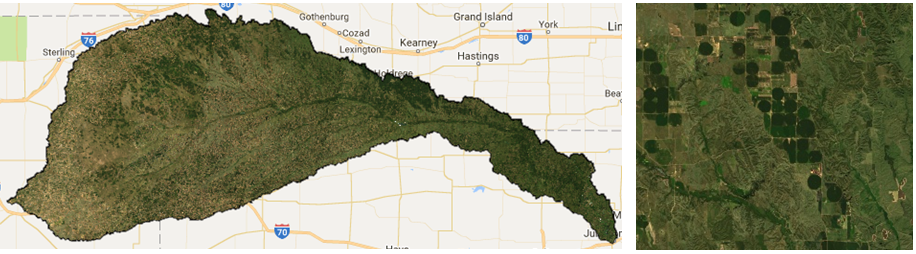
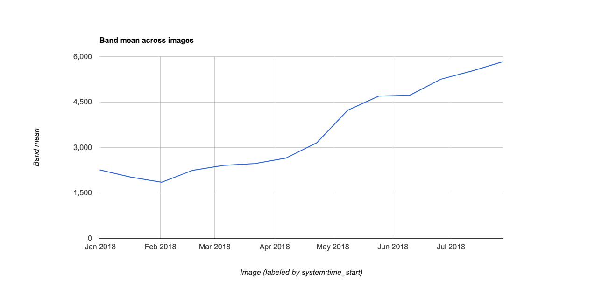

# Overview: Satellite Imagery at Regional Scales
Most satellite products are broken up into tiles for distribution. Global Landsat data is broken up in ~180 km2 scenes, with unique path/row identifiers. 455 scenes cover the United States. Each scene is currently imaged every 16 days by Landsat 8, and every 16 days by Landsat 7 (approximately 45 times each year). The edges of each path overlap, providing increased temporal frequency in these areas. However, cloudy skies during satellite overpass and other acquisition anomalies make certain scenes or pixels unusable.

 
**455 Landsat scenes cover the United States:**
 

  

For most regional-scale applications, you will need to combine multiple satellite images to fully cover your spatial extent and fill in missing data caused by clouds, etc. Google Earth Engine (GEE) is particularly well suited to these tasks.

A static version of the code can be accessed here: [https://code.earthengine.google.com/cbb204bbe485986b63485ee39c8382cc](https://code.earthengine.google.com/cbb204bbe485986b63485ee39c8382cc)*

# Exercise: Basic GEE Workflow
Here, we will leverage GEE to create a composite satellite image representing the peak growing season for a watershed of interest.

### Image Collections
A stack or time series of images are called `Image Collections`. Each data source available on GEE has it's own Image Collection and ID (for example, the [Landsat 5 SR collection](https://code.earthengine.google.com/dataset/LANDSAT/LT5_SR), or the [GRIDMET meteorological data collection](https://code.earthengine.google.com/dataset/IDAHO_EPSCOR/GRIDMET)). You can also create image collections from individual images or merge existing collections. More information on Image Collections can be found [here in the GEE Developer's Guide](https://developers.google.com/earth-engine/ic_creating).

In order to generate images that cover large spatial areas and to fill in image gaps due to clouds, etc, we can load a full `ImageCollection` but filter the collection to return only the time periods or spatial locations that are of interest. There are shortcut filters for those commonly used (imageCollection.filterDate(), imageCollection.filterBounds()...), but most filter in the `ee.Filter()` section of the Docs tab can be used. Read more about [filters on the Developer's Guide](https://developers.google.com/earth-engine/ic_filtering).

### Load Vector Boundary
We'll work on making a composite satellite image for a US watershed. The easiest way to filter for an irregular location without having to identify the paths and rows of the satellite image tiles is to use a vector polygon.

There are four ways to obtain vector data in GEE:

  * [Upload a shapefile](https://developers.google.com/earth-engine/importing) directly to your personal *Asset* folder in the top left panel. You can create subfolders and set sharing permissions on these as needed. We use an asset vector file in the [Accessing Satellite Imagery module](https://geohackweek.github.io/GoogleEarthEngine/03-load-imagery/).
  * Import an existing [Google Fusion Table](https://support.google.com/fusiontables#topic=1652595), or [create your own](https://fusiontables.google.com/data?dsrcid=implicit) fusion table from a KML in WGS84.  Each fusion table has a unique Id (File > About this table) that can be used to load it into GEE. GEE only recently added the Asset option, so you may see folks still using fusion tables in the forums, etc. If you have the choice, I'd use an asset.
  * Use an existing vector dataset in GEE. (Browse the vector dataset catalog here)[https://developers.google.com/earth-engine/vector_datasets].
  * Manually draw points, lines, and polygons using the geometry tools in the code editor. We do this in the [Classify Imagery Module](https://geohackweek.github.io/GoogleEarthEngine/05-classify-imagery/).

Here, we will use an existing vector asset, the [USGS Watershed Boundaries - HUC12](https://code.earthengine.google.com/dataset/USGS/WBD/2017/HUC12)

In order to load a vector file from your Assets into your workspace, we need to use the "filepath" and cast it to a `ee.FeatureCollection` data type. Read more here under ["Managing Assets" in the Developer's Guide](https://developers.google.com/earth-engine/asset_manager#importing-assets-to-your-script).


// load a polygon watershed boundary (here, a public vector dataset already in GEE)
// note: see tutorial linked above for guidance on importing vector datasets
var WBD = ee.FeatureCollection("USGS/WBD/2017/HUC06");
print(WBD.limit(5));
Map.addLayer(WBD, {}, 'watersheds')


 

  

### The Inspector Tool
The "Inspector" tool allows you to query map layers at a point. We will use this to help us select a specific watershed. To use the inspector tool, click on the "Inspector" tab in the upper right panel to activate it. Then click anywhere within the Map Viewer. The coordinates of your click will be displayed, along with the value for map layers at that point.

We can use this to find the "name" attribute of our watershed of interest (pick any you want!).

 

  

Once you've determined the "name" property for your watershed, use the featureCollection.filterMetadata() function to extract this watershed from the full dataset.


// use the inspector tool to find the name of a watershed that interests you
var watershed = WBD.filterMetadata('name', 'equals', 'Republican');
print(watershed);

// set the map view and zoom level, and add watershed to map
Map.centerObject(watershed,7);
Map.addLayer(watershed, {}, 'watershed');


Watershed of interest: The Republican River Basin
 

  

### Filter an Image Collection
Here, we are selecting all imagery in the [Landsat 8 Surface Reflectance collection](https://code.earthengine.google.com/dataset/LANDSAT/LC08/C01/T1_SR) acquired over our watershed anytime during last year.

*Tip: Image collection IDs are found in the "Search" toolbar at the top of the code editor or through searching the [data archive](https://code.earthengine.google.com/datasets/).*


// load all Landsat 8 SR image within polygon boundary for last year
var l8collection = ee.ImageCollection('LANDSAT/LC08/C01/T1_SR')
          .filterBounds(watershed)
          .filterDate('2017-01-01', '2017-12-31');
print(l8collection);


Printing our filtered collection to console tells us how many images are in our filter (173) as well as the band names and properties for the images in our collection:
 

  

### Mapping functions
As you can see by browsing the `Docs` tab in the upper left panel of the code editor, there are GEE functions specific to both the `Image` and `ImageCollection` data types. There are a lot, including mathematical and boolean operators, convolutions and focal statistics, and spectral transformations and analyses of spatial texture. Browse the list, or read about general operations available in the [GEE Developer's Guide "Image Overview"" section](https://developers.google.com/earth-engine/image_overview).

Often, we want to use a function over each image in an image collection. To do so, we need to essentially "loop" through each image in the image collection. In GEE, "loops" are accomplished with the .map() function.

**Avoid actual loops at all costs.** Using a for loop brings the operation into the browser (bad).
Using imageCollection.map() sends the operation to Google's servers for distributed runs (good). Loops implemented in typical for loop fashion bring the operation into the browser, and won't work well, if at all.

More information about mapping functions over image collections can be found [here in the Developer's Guide](https://developers.google.com/earth-engine/ic_mapping).

The .map() concept applies to `featureCollections` as well - to apply a function to each feature in a collection, we map that function across the featureCollection with featureCollection.map(). See ["Mapping over a Feature Collection"](https://developers.google.com/earth-engine/feature_collection_mapping) in the Developer's Guide.

### Masking clouds
Here, we'll make use of the `pixel_qa` cloud band provided with the SR products to mask pixels with clouds, cloud shadows, and snow. We will mask pixels in the image based on the value of pixel_qa.

We explicitly define a new function called "maskClouds" and apply it to each image in the imageCollection by using `imageCollection.map()`. Functions need to explicitly **return** the final output.



// Mask pixels with clouds and cloud shadows -------------------------------------

// Surface reflectance products come with a 'pixel_qa' band
// that is based on the cfmask. Read more here:
// https://landsat.usgs.gov/landsat-surface-reflectance-quality-assessment

// create function to mask clouds, cloud shadows, snow
var maskClouds = function(image){
  // make a new single band image from the pixel qa band
  var pixel_qa = image.select('pixel_qa');
  // keep clear (0) and water (1) pixels
  return image.updateMask(pixel_qa.eq(322));   
};

// use "map" to apply the function to each image in the collection
var l8masked = l8collection.map(maskClouds);

// visualize the first image in the collection, pre- and post- mask
var visParams = {bands: ['B4','B3','B2'], min: 150, max: 2000}

Map.addLayer(ee.Image(l8masked.first()), visParams, 'clouds masked', false)
Map.addLayer(ee.Image(l8collection.first()), visParams, 'original', false)


 

  

### Calculating NDVI as a New Band
Similarly, if we want to calculate the NDVI in each image and add it as a new band, we need to create a function and map it over the collection. Here, we use the `normalizedDifference()` function. The [Mathematical Operations page in the GEE Developer's Guide](https://developers.google.com/earth-engine/image_math) provides more information about simple and complex raster calculations.


// create function to add NDVI using NIR (B5) and the red band (B4)
var getNDVI = function(img){
  return img.addBands(img.normalizedDifference(['B5','B4']).rename('NDVI'));
};

// extra example: an equivalent function using straight band math
var getNDVI2 = function(img){
  return img.addBands(img.select('B5').subtract(img.select('B4'))
            .divide(img.select('B5').add(img.select('B3'))));
};

// map over image collection
var l8ndvi = l8masked.map(getNDVI);

// print one image to see the band is now there
print(ee.Image(l8ndvi.first()));


### Create an "Greenest Pixel" Composite
We now need to assemble the image collection to create one continuous image across the watershed. There are several mosaicking/compositing options available, from simple maximum value composites (`imageCollection.max()`) and straightforward mosaics with the most recent image on top (`imageCollection.mosaic()`). The [Compositing and Mosaicking page on the Developer's Guide](https://developers.google.com/earth-engine/ic_composite_mosaic) provides examples of these.

Here, we will use the `imageCollection.qualityMosaic()` function. By prioritizing the image to use based on one specific band, this method ensures that the values across all bands are taken from the same image. Each pixel gets assigned the values from the image with the highest value of the desired band.

We will use this to make a "greenest pixel composite" for our watershed based on the NDVI band we just calculated. The final composite image will retain all bands in the input (unless we were to specify otherwise). Each pixel in the composite image could potentially come from imagery acquired on different dates, but all bands within each pixel are from the same image. In general, this provides the best available snapshot of the landscape at the peak of the growing season, regardless of the phenological timing within the year.


// for each pixel, select the "best" set of bands from available images
// based on the maximum NDVI/greenness
var composite = l8ndvi.qualityMosaic('NDVI').clip(watershed);
print(composite);

// Visualize NDVI
var ndviPalette = ['FFFFFF', 'CE7E45', 'DF923D', 'F1B555', 'FCD163', '99B718',
               '74A901', '66A000', '529400', '3E8601', '207401', '056201',
               '004C00', '023B01', '012E01', '011D01', '011301'];
Map.addLayer(composite.select('NDVI'),
            {min:0, max: 1, palette: ndviPalette}, 'ndvi');


Annual maximum NDVI across this watershed highlight irrigated agricultural areas:

 

  

We can also use this composite image to visualize a true color composite using the RGB bands:


// Visualize true color composite
Map.addLayer(composite, {bands: ['B4', 'B3', 'B2'], min: 0, max: 2000}, 'true color composite', false);


 

  

### Visualize Data in a Chart
To briefly illustrate GEE's ability to display data charts, we load a MODIS NDVI data product to chart the annual time series of mean NDVI for our watershed. Charting is also covered in the [Spatial and Temporal Reducers Module](https://geohackweek.github.io/GoogleEarthEngine/04-reducers/).



// Chart annual time series of mean NDVI in watershed
// from our Landsat 8 computed NDVI
var chart = ui.Chart.image.series({
    imageCollection: l8ndvi.select('NDVI'),
    region: watershed,
    reducer: ee.Reducer.mean(),
    scale: 250,
})
print(chart)  //** Can export the figure or data in the pop-out

// You can also compare to the MODIS 16 day product

// add satellite time series: MODIS NDVI 250m 16 day product
var modis = ee.ImageCollection('MODIS/006/MOD13Q1')
          .filterBounds(watershed)
          .filterDate('2017-01-01', '2017-12-31')
          .select('NDVI');

// Chart annual time series of mean NDVI in watershed
// from the smoothed MODIS 16 day product
var chart = ui.Chart.image.series({
    imageCollection: modis,
    region: watershed,
    reducer: ee.Reducer.mean(),
    scale: 250
})
print(chart)



Note you can export the chart's underlying data using the arrow pop-out icon..
 

  

### Exporting Data as a Table
The most memory-efficient way to get data out of GEE is in a table. This way has the benefit of being scripted and thus fully reproducible. Table exports also require much less compute power than exporting a whole image. When you are constructing an analysis, think hard about how you can leave the raster in the cloud and just extract the data you need as an array.



// Use the buttons on the pop-out chart to export the .csv, or you can script
// the export as follows using a reducer:

// get the mean value for the region from each image
var ts = modis.map(function(image){
  var date = image.get('system:time_start');
  var mean = image.reduceRegion({
    reducer: ee.Reducer.mean(),
    geometry: watershed,
    scale: 250
  });
  // and return a feature with 'null' geometry with properties (dictionary)  
  return ee.Feature(null, {'mean': mean.get('NDVI'),
                            'date': date})
});

// Export a .csv table of date, mean NDVI for watershed
Export.table.toDrive({
  collection: ts,
  description: 'geohack_2017_MODIS_NDVI_stats',
  folder: 'GEE_geohackweek',
  fileFormat: 'CSV'
});

// AND HIT 'RUN' IN THE TASKS TAB IN THE UPPER RIGHT PANEL



To execute export tasks, you need to then go to the 'Tasks' tab in the upper right panel and hit 'Run'.

 

  

### Exporting Images
Users can export the results of their image manipulations to their GEE Asset folder for downstream use within GEE or to their personal Google Drive or Google Cloud Storage accounts. Here, we export a single-band image of annual maximum NDVI for our watershed. Examples are provided for asset and Google Drive exports. More information on exporting can be found [here in the Developers Guide](https://developers.google.com/earth-engine/exporting).

In the JavaScript API, all exports are sent to the 'Tasks' tab in the upper right panel. To prevent users from inadvertently overwhelming the system with gratuitous, accidental tasks, you need to explicitly run individual exports from the 'Tasks' tab. You can change filenames and other parameters here if necessary, or hard code these into your script.

When exporting to Google Drive, GEE will find the named folder specified and does not need the full file path. If this folder does not yet exist, it will create it for you in your Drive.



// Export is unnecessary, but here are code examples for out to save a
// image composite if desired.  

// select only the ndvi band
var ndvi = composite.select('NDVI');

// Google Drive Export Example
// (note: need to hit 'Run' in the task tab in upper right panel)
Export.image.toDrive({
  image: ndvi,
  description: 'geohack_2017_L8_NDVI_image',
  scale: 30,
  region: watershed.geometry().bounds(), // .geometry().bounds() needed for multipolygon
  crs: 'EPSG:5070',
  folder: 'GEE_geohackweek',
  maxPixels: 2000000000
});

// Asset Folder Export Example
// (note: need to hit 'Run' in the task tab in upper right panel)
Export.image.toAsset({
  image: ndvi,
  description: 'geohack_2017_L8_NDVI_image',
  assetId: 'users/yourname/geohack_2017_L8_NDVI_image',
  scale: 30,
  region: watershed.geometry().bounds(),
  pyramidingPolicy: {'.default':'mean'}, // use {'.default':'sample'} for discrete data
  maxPixels: 2000000000
});


