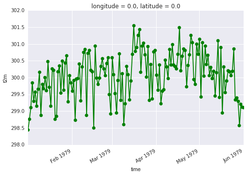
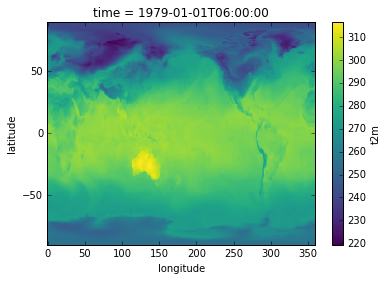
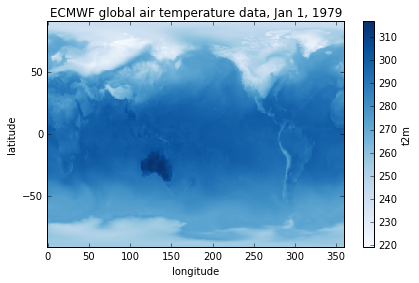

### Plotting data in 1 dimension

Let's start visualizing some of the data slices we've been working on so far. We will begin by creating a new variable for plotting a 1-dimensional time series:

~~~
time_series = ds['t2m'].sel(time=slice('1979-01-01T06:00:00', '1979-06-01T06:00:00'), latitude=75.0, longitude=180.0)
~~~
{: .python}

xarray has some very simple tools to enable quick visualizations of the data. Try this:

~~~
%matplotlib inline  # optional, if using Jupyter-notebooks
time_series.plot()
~~~
{: .python}

 

 

Your plots can be [customized](http://xarray.pydata.org/en/stable/plotting.html) using syntax that is very similar to Matplotlib. For example:

~~~
time_series.plot.line(color='green', marker='o')
~~~
{: .python}

 

 

### Plotting data in 2 dimensions

Since many xarray applications involve geospatial datasets, xarray's plotting extends to maps in 2 dimensions. Let's first select a 2-D subset of our data by choosing a single date and retaining all the latitude and longitude dimensions:

~~~
map_data = ds['t2m'].sel(time='1979-01-01T06:00:00')
~~~
{: .python}

Note that in the above label-based lookup, we did not specify the latitude and longitude dimensions, in which case xarray assumes we want to return all elements in those dimensions.

Now, similar to what we did for 1-D plots, simply call do the following to generate a map:

~~~
map_data.plot()
~~~
{: .python}

 

 

Customization can occur following standard Matplotlib syntax. Note that before we use matplotlib, we will have to import that library:

~~~
import matplotlib.pyplot as plt
map_data.plot(cmap=plt.cm.Blues)
plt.title('ECMWF global air temperature data')
plt.ylabel('latitude')
plt.xlabel('longitude')
plt.tight_layout()
plt.show()
~~~
{: .python}

 

 
