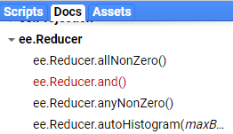
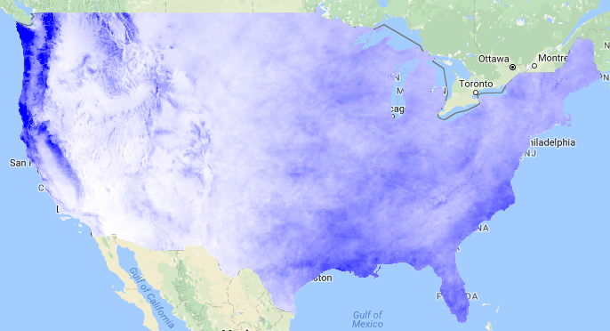
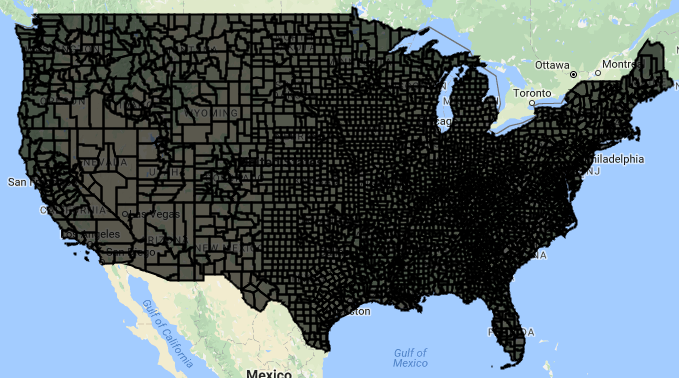
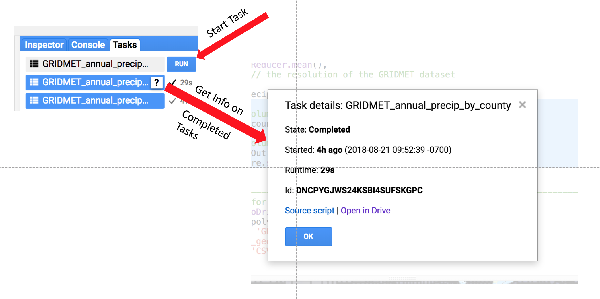

Link to a static version of the full script used in this module:
[https://code.earthengine.google.com/269a0d4a6b9854e6f81ac87187a72559](https://code.earthengine.google.com/269a0d4a6b9854e6f81ac87187a72559)

# Reducers: Overview

In Google Earth Engine (GEE), [reducers](https://developers.google.com/earth-engine/reducers_intro) are used to aggregate data over time, space, and other data structures. They belong to the `ee.Reducer` class and include summary statistics, histograms, and linear regression, among others. Here's a visual from Google demonstrating a reducer applied to an `ImageCollection`:

 

  

Reductions can also occur in space, over bands within an image, or over the attributes of a `FeatureCollection`. See the [Reducer Overview](https://developers.google.com/earth-engine/reducers_intro) in the Google Developer's Guide for more information.

In Episode 3: Accessing Satellite Imagery, we used a vector boundary and date range to filter an image collection, mapped an algorithm (NDVI) over that collection, and then reduced that collection to one image in which each pixel value was its maximum NDVI. Here we follow the same workflow, but instead reduce using `imageCollection.sum()` to calculate total annual precipitation for each pixel in the US (temporal reducers). We then take it a step further and use the spatial reducer 'reduceRegions' to calculate total annual precip for each US county.

# Exercise: Obtain climate data from GEE
Here, we will demonstrate a temporal reducer and a spatial reducer by obtaining data on annual precipitation by US county.

### GEE Data Catalog
A secondary objective to this exercise is to use GEE to access common datasets stored in the data archive that may appeal to those not directly interested in remote sensing applications. As described in the [Introduction](https://geohackweek.github.io/GoogleEarthEngine/01-introduction/), GEE has co-located a number of datasets relevant to earth systems analyses. The full archive can be browsed [here](https://code.earthengine.google.com/datasets/). In this exercise, we will use the [GRIDMET Meteorological Dataset](https://code.earthengine.google.com/dataset/IDAHO_EPSCOR/GRIDMET) to obtain precipitation. Briefly, GRIDMET blends PRISM and NLDAS to produce a daily, 4 km gridded climate dataset for the contiguous United States from 1979 - present.

### Temporal Reducer: Get Image Statistics Over Time
As discussed in [Accessing Satellite Imagery](https://geohackweek.github.io/GoogleEarthEngine/03-load-imagery/), an `ImageCollection` is a stack or time series of images. Reducers are used to derive a single `Image` based on the `ImageCollection`. Operations occur on a per pixel basis. We will follow this workflow:

  * "Load" the GRIDMET data as an `ImageCollection`
  * Filter for the precipitation data band and dates desired
  * **Reduce** 365 "raster" images of daily precipitation into one raster image of annual precipitation totals (aka sum rasters by pixel)
  * Visualize the result

#### Load and Filter the ImageCollection
First, we need to identify the **ImageCollection ID** for the GRIDMET data product and the **band name** for the precipitation data (and check any relevant metadata). You can find this either in the [data catalog](https://code.earthengine.google.com/datasets/) or directly in the [GEE Code Editor](https://code.earthengine.google.com/) at the top above  the center panel.

From the [GRIDMET description](https://code.earthengine.google.com/dataset/IDAHO_EPSCOR/GRIDMET), we know the ImageCollection ID = 'IDAHO_EPSCOR/GRIDMET' and the precipitation band name is 'pr'. We will specifically `select` this band only.



// load precip data (mm, daily total): 365 images per year
var precipCollection = ee.ImageCollection('IDAHO_EPSCOR/GRIDMET')
                    .select('pr')   // select  precip band only
                    .filterDate('2017-01-01', '2017-12-31');
print(precipCollection, 'precipCollection');



By printing the resulting collection to the Console, we can see we've accessed 365 images, each with 1 band named 'pr'.

#### Apply a Sum Reducer and Visualize Results
The `imageCollection.reduce()` operator allows you to apply any function of class `ee.Reducer()` to all images in the collection. If your `ImageCollection` had multiple bands, the reducer is applied separately to all bands (unless the reducer uses multiple bands as inputs, in which case the number of bands in the image collection must match the number of inputs required by the reducer). You can find available reducers and their descriptions in the searchable API reference under the **Docs** tab in the upper left panel of the code editor.

 

  

Some commonly used reducers have shortcut syntax, such as `imageCollection.mean()`, `imageCollection.min()`, and conveniently, `imageCollection.sum()`. Both syntaxes are demonstrated in the following code chunk.



// load precip data (mm, daily total): 365 images per year
var precipCollection = ee.ImageCollection('IDAHO_EPSCOR/GRIDMET')
                    .select('pr')   // select  precip band only
                    .filterDate('2017-01-01', '2017-12-31');
print(precipCollection);  

// reduce the image collection to one image by summing the 365 daily rasters
var annualPrecip = precipCollection.reduce(ee.Reducer.sum());
print(annualPrecip);

// equivalent shortcut syntax
var annualPrecip2 = precipCollection.sum();

// visualize annual precipitation
var precipPal = ['white','blue'] // store palette as variable               
Map.addLayer(annualPrecip, {min: 60, max: 3000, palette: precipPal}, 'precip');



By printing the resulting image to the Console, we can see we now have 1 image with 1 band named 'pr_sum'. Here's what it looks like:

 

  

### Spatial Reducer: Get Image Statistics By Regions
Now let's take the image of annual precipitation we just created and get the mean annual precipitation by county in the United States. To get image statistics for multiple regions, we can use an [image.reduceRegions()](https://developers.google.com/earth-engine/reducers_reduce_regions) call. We will use a [FeatureCollection](https://developers.google.com/earth-engine/feature_collections) to store our vector dataset of counties. Note that there is also a [image.reduceRegion()](https://developers.google.com/earth-engine/reducers_reduce_region) operator if you wanted to summarize one polygon region only. The result of the `reduceRegions()` operation is added to the properties of each feature in the `FeatureCollection`.

  >*An important note on the scale parameter**

  > GEE uses lazy code evaluation that only executes parts of your script needed for results - in the case of the JavaScript API code editor environment, that means things needed to fulfill print statements, map visualizations, or export tasks. *GEE will run your computations at the resolution of your current map view in the code editor unless you tell it otherwise.* Whenever possible, explicitly set the scale arguments to force GEE to work in a scale that makes sense for your imagery/analysis. Read the [modifiable areal unit problem](https://en.wikipedia.org/wiki/Modifiable_areal_unit_problem) wiki or the [Developers Docs](https://developers.google.com/earth-engine/scale) to see why this matters.

#### Load the County Boundaries (Vector Data)

There are four ways to obtain vector data in GEE as discussed in [03 Accessing Satellite Imagery](https://geohackweek.github.io/GoogleEarthEngine/03-load-imagery/). Here, we will use an [existing public fusion table of county boundaries](https://fusiontables.google.com/data?docid=1xdysxZ94uUFIit9eXmnw1fYc6VcQiXhceFd_CVKa#map:id=2) from the US Census Bureau.

This dataset includes entities outside of the contiguous US such as Alaska, Puerto Rico, and American Samoa. We will remove these based on their unique ID's in a property attribute containing "state" FIPS codes to demonstrate vector filtering.


// load regions: counties from a public fusion table, removing non-conus states
// by using a custom filter
var nonCONUS = [2,15,60,66,69,72,78] // state FIPS codes that we don't want
var counties = ee.FeatureCollection('ft:1ZMnPbFshUI3qbk9XE0H7t1N5CjsEGyl8lZfWfVn4')
        .filter(ee.Filter.inList('STATEFP',nonCONUS).not());
print(counties, 'counties');

// visualize
Map.addLayer(counties,{},'counties');  


By printing the county featureCollection, we see there are 3108 county polygons and 11 columns of attribute data.

 

  

#### Apply the spatial reducer


// get mean precipitation values by county polygon
var countyPrecip = annualPrecip.reduceRegions({
  collection: counties,
  reducer: ee.Reducer.mean(),
  scale: 4000 // the resolution of the GRIDMET dataset
});
print(countyPrecip);


By printing the countyPrecip featureCollection, we see there are 3108 county polygons and now 12 columns of attribute data, with the addition of the "mean" column.

### Format the Results for Export
GEE can export tables in CSV (default), GeoJSON, KML, or KMZ. Here, we do a little formatting to prepare our FeatureCollection for export as a CSV.

Formatting includes:

* removing the .geo column for a tidier dataset (this column can get quite large when polygons are highly detailed, but there's no reason that you have to do this step)
* Adding a Column Attribute for the year of the precip data to demonstrate attribute manipulation. This can only be done to Features, so we map a function to do this over the features within the Feature Collection



// drop .geo column (not needed if goal is tabular data)
var polyOut = countyPrecip.select(['.*'],null,false);

// add a new column for year to each feature in the feature collection
polyOut = polyOut.map(function(feature){
return feature.set('Year',2017);
});

// Table to Drive Export Example

Export.table.toDrive({
  collection: polyOut,
  description: 'GRIDMET_annual_precip_by_county',
  folder: 'GEE_geohackweek',
  fileFormat: 'CSV'
});   

// AND HIT 'RUN' IN THE TASKS TAB IN THE UPPER RIGHT PANEL


Note on the folder name: If this folder exists within  your Google Drive, GEE will find it and export here regardless of the full file path for the folder. If the folder doesn't exist, GEE will create it upon export.

### Start the Export Task

In order to actually export your data, you have to explicitly hit the "Run" button under the "Tasks" tab in the upper right panel of the code editor. It should take 20-30 seconds to export, depending on GEE user loads.

A new, helpful feature has been added where you can hold your mouse over right side of the completed task and click on the question mark to open a window with details on the task as in the diagram below.

 

  

Link to a static version of the full script used in this module:
(https://code.earthengine.google.com/269a0d4a6b9854e6f81ac87187a72559)
