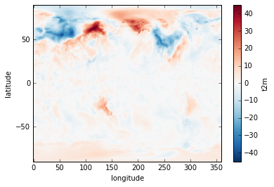
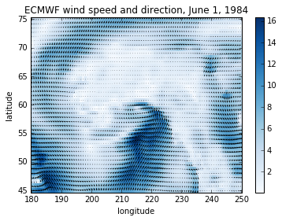
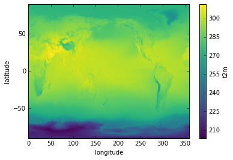

### Arithmetic

Suppose we want to plot the difference in air temperature between January 1 in 1979 versus 1980. We can do this by taking advantage of xarray's labeled dimensions to simplify arithmetic operations on `DataArray` objects:

~~~
temperature1 = ds['t2m'].sel(time='1979-01-01T06:00:00')
temperature2 = ds['t2m'].sel(time='1980-01-01T06:00:00')
delta = temperature1 - temperature2
delta.plot()
~~~
{: .python}

 

 

Note that the subtraction is automatically vectorized over all array values, as in numpy.

### Mathematical functions

Now, sometimes we need to apply mathematical functions to array data in our analysis. A good example is wind data, which are often distributed as orthogonal "u" and "v" wind components. To calculate the wind magnitude we need to take the square root of the sum of the squares. For this we use numpy [ufunc](http://docs.scipy.org/doc/numpy/reference/ufuncs.html) commands that can operate on a `DataArray`. Let's look at our wind datasets:

~~~
import xarray.ufuncs as xu
import matplotlib.pyplot as plt
wind = xr.open_mfdataset(r'c:/work/mnt/ecmwf/*wind_AK.nc').sel(time="1984-01-01T06:00:00")
windspeed = xu.sqrt(wind.u10**2+wind.v10**2)
~~~
{: .python}

Notice we introduced something new in opening our data. Since we need to access two netCDF files, we used xarray's [open_mfdataset](http://xarray.pydata.org/en/stable/generated/xarray.open_mfdataset.html?highlight=open_mfdataset), which allows us to read any number of netCDF files into a single `Dataset`. Here we use a wildcard search to find the two wind datasets. Note that xarray exposes a wide range of mathematical functions this way, such as  `sin`, `cos`, etc.

Now to plot the data:

~~~
windspeed.plot(cmap=plt.cm.Blues)
plt.title('ECMWF wind speed and direction, June 1, 1984')
plt.ylabel('latitude')
plt.xlabel('longitude')
x = windspeed.coords['longitude'].values
y = windspeed.coords['latitude'].values
plt.quiver(x, y, wind.u10.values, wind.v10.values)
~~~
{: .python}

 

 

### Aggregation

Aggregation methods can be applied to a `DataArray` over a specified dimension. Suppose we want to calculate the average June/July/August temperature for a particular year. Let's create a `DataArray` that slices out those months of data for a particular year:

~~~  
JJA = ds['t2m'].sel(time=slice('1979-06-01T06:00:00','1979-09-01T06:00:00'))
~~~
{: .python}

Now we simply apply the `mean` aggregation method over the time dimension and plot the result:

~~~~
JJA.mean(dim='time').plot()
~~~
{: .python}

 

 

> ## Aggregation
> Using the JJA DataArray created above, calculate the maximum air temperature during the JJA period at each latitude and longitude.
> Plot the result in degrees Celsius as a map. Also, calculate the standard deviation in global air temperature during the JJA period,
> and plot the results as a 1-D time series.
{: .challenge}
