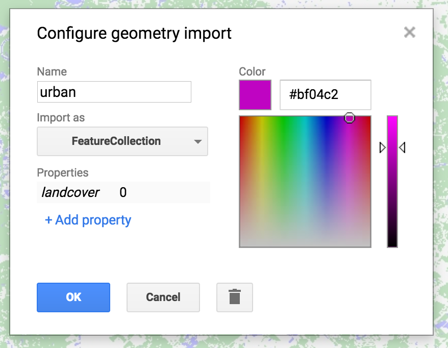
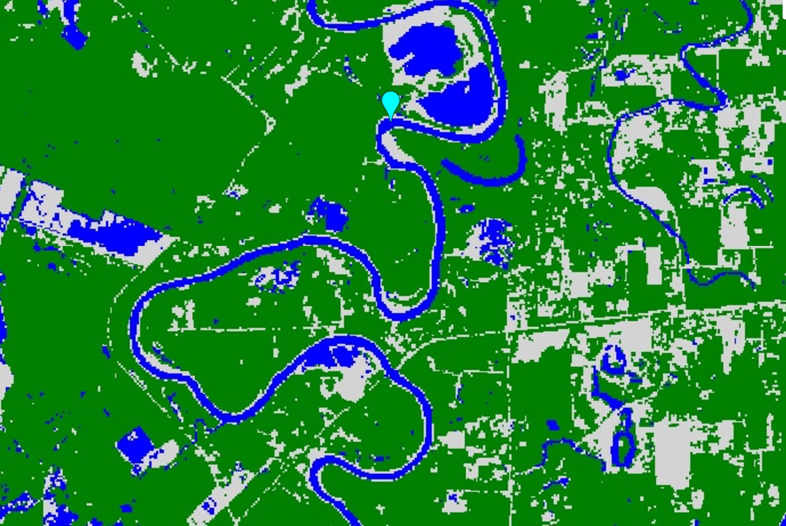

# Classifiers Overview

Google Earth Engine provides users with the opportunity to conduct many advanced analysis, including spectral un-mixing, object-based methods, eigen analysis and linear modeling.  Machine learning techniques for supervised and unsupervised classification are also available. In this example, we will use supervised classification for land cover classification.

The purpose is to get a classified map of land cover in an area of interest. We will examine Landsat imagery and manually identify a set of training points for three classes (water, forest, urban). We will then use those training points to train a classifier. The classifier will be used to classify the rest of the Landsat image into those three categories. We can then assess the accuracy of our classification using `classifier.confusionMatrix()`.

Link to full code we used in this session:
[https://code.earthengine.google.com/84027208bf2a94e77b5f14075fc5a938](https://code.earthengine.google.com/84027208bf2a94e77b5f14075fc5a938)

*Adapted from the [Earth Engine 201 Intermediate workshop](https://developers.google.com/earth-engine/classification)*

# Exercise: Creating a land cover classification from Landsat imagery

### Creating an ROI from coordinates

First we need to define a region of interest (ROI). Instead of using an imported asset, we will use a single coordinate that we will manually define. I am interested in doing a classification around Houston, so I will use the city center as my lat/long.


// Define a region of interest as a point.  Change the coordinates
// to select an ROI in your area of interest.
// You can use the inspector tool to find your coordinates
var roi = ee.Geometry.Point(-95.6223, 29.7381);


### Loading an `ImageCollection` and filtering to a single image

Now we will load Landsat imagery and filter to the area and dates of interest.  We can use `sort` to filter the `ImageCollection` by % cloud cover, a property included with the Landsat Top of Atmosphere (TOA) collection. We then select the `first` (least cloudy) `Image` from the sorted `ImageCollection` .



// Load the Landsat 8 scaled radiance image collection.
var landsatCollection = ee.ImageCollection('LANDSAT/LC08/C01/T1')
    .filterDate('2017-01-01', '2017-12-31');

// Make a cloud-free composite.
var composite = ee.Algorithms.Landsat.simpleComposite({
  collection: landsatCollection,
  asFloat: true
});

// Visualize the Composite
Map.addLayer(composite, {bands: ['B4', 'B3', 'B2'], max: 0.5, gamma: 2}, 'L8 Image', false);



### Collect Training Data

The second step is to collect training data.  Using the imagery as guidance, hover over the 'Geometry Imports' box next to the geometry drawing tools and click '+ new layer.'  Each new layer represents one class within the training data. Let the first new layer represent 'urban.'  Locate points in the new layer in urban or built up areas (buildings, roads, parking lots, etc.).  When finished collecting points, click 'Exit' and configure the import (top of the script) as follows.  Name the layer 'urban' and click the  icon to configure it.  'Import as' `FeatureCollection`.  'Add property' landcover and set its value to 0.  (Subsequent classes will be 1 for water, 2 for forest, etc.)  when finished, click 'OK' as shown:

 

  

When you are finished making a `FeatureCollection` for each class (3 total), you now can merge them into one `FeatureCollection` using `featureCollection.merge()`. This will convert them into one collection in which the property **landcover** has a value that is the class (0, 1, 2).


// Merge points together
var newfc = water.merge(urban).merge(forest);
print(newfc, 'newfc')


The print statement will display the new collection in the **Console**.

### Sample Imagery at Training Points to Create Training datasets

Now that you have created the points and labels, you need to sample the Landsat 8 imagery using `image.sampleRegions()`. This command will extract the reflectance in the designated bands for each of the points you have created. A conceptual diagram of this is shown in the image below. We will use reflectance from the optical, NIR, and SWIR bands (B2 - B7).

 

  


// Select the bands for training
var bands = ['B2', 'B3', 'B4', 'B5', 'B6', 'B7'];

// Sample the input imagery to get a FeatureCollection of training data.
var training = composite.select(bands).sampleRegions({
  collection: newfc,
  properties: ['landcover'],
  scale: 30
});


The `FeatureCollection` called **training** has the reflectance value from each band stored for every training point along with its class label.

### Train the classifier
We will now instantiate a `classifier` using `ee.Classifier.randomForest()` and `train` it on the training data specifying the features to use (training), the landcover categories as the `classProperty` we want to categorize the imagery into, and the reflectance in B2 - B7 of the Landsat imagery as the `inputProperties`.


// Make a Random Forest classifier and train it.
var classifier = ee.Classifier.randomForest().train({
  features: training,
  classProperty: 'landcover',
  inputProperties: bands
});


Other classifiers, including Support Vector Machines (SVM) and Classification and Regression Trees (CART) are available in Earth Engine. See the [Supervised Classification User Guide](https://developers.google.com/earth-engine/classification) for more examples.

### Classify the Image & Display the Results

Use the new `classifier` to classify the rest of the imagery.


// Classify the input imagery.
var classified = composite.select(bands).classify(classifier);

// Define a palette for the Land Use classification.
var palette = [
  'D3D3D3', // urban (0)  // grey
  '0000FF', // water (1)  // blue
  '008000' //  forest (2) // green
];

// Display the classification result and the input image.
Map.setCenter(-96.0171, 29.6803);
Map.addLayer(classified, {min: 0, max: 2, palette: palette}, 'Land Use Classification');


You should get an image that looks sort of like the one below. Pan around the map and use the inspector to and see how you did!

 

  

### Assess the Accuracy

We can assess the accuracy of the trained `classifier` using a `confusionMatrix`.



// Get a confusion matrix representing resubstitution accuracy.
print('RF error matrix: ', classifier.confusionMatrix());
print('RF accuracy: ', classifier.confusionMatrix().accuracy());



Word of warning: In this particular example, we are just looking at the `trainAccuracy`, which basically describes how well the `classifier` was able to correctly label resubstituted training data, i.e. data the `classifier` had already seen. To get a true validation accurcay, we need to show the classifier new 'testing' data. The repository code has a bonus section at the end that holds out data for testing, applies the classifier to the testing data and assesses the `errorMatrix` for this withheld validation data. The last example in the [Supervised Classification User Guide](https://developers.google.com/earth-engine/classification) also gives example code for this process.
