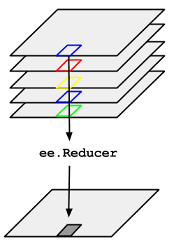

## Reducers: Overview

In Google Earth Engine (GEE), [reducers](https://developers.google.com/earth-engine/reducers_intro) are used to aggregate data over time, space, and other data structures. They belong to the `ee.Reducer` class and include summary statistics, histograms, and linear regression, among others. Here's a diagram from Google demonstrating a reducer applied to an `ImageCollection`:

Reductions can also occur in space, over bands within an image, or over the attributes of a `FeatureCollection`. See the [Reducer Overview](https://developers.google.com/earth-engine/reducers_intro) in the Google Developer's Guide for more information.

## Exercise: Obtain climate data from GEE
Here, we will demonstrate a temporal reducer and a spatial reducer by obtaining data on annual precipitation by US county. 

### GEE Data Catalog
A secondary objective to this exercise is to use GEE to access common datasets stored in the data archive that may appeal to those not directly interested in remote sensing applications. As described in the [Introduction](https://geohackweek.github.io/GoogleEarthEngine/01-introduction/), GEE has co-located a number of datasets relevant to earth systems analyses. The full archive can be browsed [here](https://code.earthengine.google.com/datasets/). In this exercise, we will use the [GRIDMET Meteorological Dataset](https://code.earthengine.google.com/dataset/IDAHO_EPSCOR/GRIDMET) to obtain precipitation. Briefly, GRIDMET blends PRISM and NLDAS to produce a daily, 4 km gridded climate dataset for the contiguous United States from 1979 - present.

### Part 1: Reduce an ImageCollection to Aggregate Over Time
As discussed in [Accessing Satellite Imagery](https://geohackweek.github.io/GoogleEarthEngine/03-load-imagery/), an `ImageCollection` is a stack or time series of images. Reducers are used to derive a single `Image` based on the `ImageCollection`. Operations occur on a per pixel basis.

**Processing Overview**

* "Load" the GRIDMET data as an `ImageCollection` 
* Filter for the precipitation data band and dates desired (2016)
* **Reduce** 365 "raster" images of daily precipitation into one raster image of annual precipitation totals (aka sum raster by pixel)
* Visualize the result

#### Get and Filter the ImageCollection
First, we need to identify the **ImageCollection ID** for the GRIDMET data product and the **band name** for the precipitation data (and check any relevant metadata). You can find this either in the [data catalog](https://code.earthengine.google.com/datasets/) or directly in the [GEE Code Editor](https://code.earthengine.google.com/) at the top above  the center panel:

From the [GRIDMET description](https://code.earthengine.google.com/dataset/IDAHO_EPSCOR/GRIDMET), we know the ImageCollection ID = 'IDAHO_EPSCOR/GRIDMET' and the precipitation band name is 'pr'. We will specificially `select` this band only.


// load precip data (mm, daily total): 365 images per year 
var cPrecip = ee.ImageCollection('IDAHO_EPSCOR/GRIDMET')
                    .select('pr')   // select  precip band only
                    .filterDate('2016-01-01', '2016-12-31');
print(cPrecip);  


By printing the resulting collection to the Console, we can see we've accessed 365 images, each with 1 band named 'pr'.

#### Apply a Sum Reducer
The `imageCollection.reduce()` operator allows you to apply any function of class `ee.Reducer()` to all images in the collection. If your `ImageCollection` had multiple bands, the reducer is applied separately to all bands (unless the reducer has multiple inputs, in which case the collection band number and number of inputs must match). You can find available reducers and their descriptions in the searchable API reference under the **Docs* tab in the upper left panel of the code editor.

 

  

Some commonly used reducers have shortcut syntax, such as `imageCollection.mean()`, `imageCollection.min()`, and conveniently, `imageCollection.sum()`. Both are demonstrated in the following code chunk.


// reduce the image collection to one image by summing the 365 daily rasters
var annualPrecip = cPrecip.reduce(ee.Reducer.sum());
print(annualPrecip);

// using equivalent "shortcut" notation available for some common stats:
var annualPrecip = cPrecip.sum();

// visualize annual precipitation --------------------------------------
var precipPal = ['white','blue'] // store palette as variable
Map.addLayer(annualPrecip, {min: 0, max: 3000, palette: precipPal}, 'precip');


 

  

### Part 2: Spatial Reducer: Get Image Statistics By Regions
