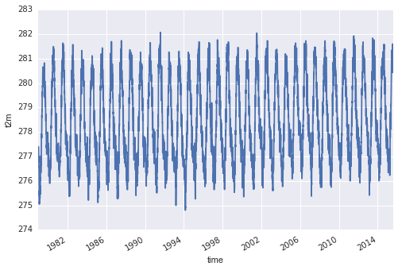
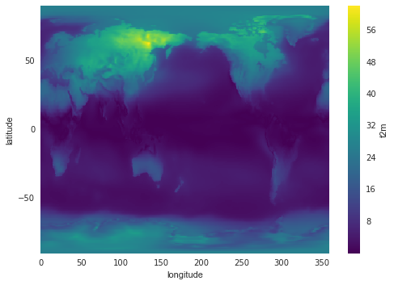

## GroupBy processing
We often want to build a time series of change from spatially distributed data. For example, suppose we need to plot a time series of the global average air temperature across the entire period of our climate data record. To accomplish this, xarray has powerful [GroupBy](http://xarray.pydata.org/en/stable/groupby.html) processing tools, similar to the well known GROUP BY processing used in SQL. In all cases we **split** the data, **apply** a function to independent groups, and **combine** back into a known data structure.

### Groupby processing: split

We can `groupby` the name of a variable or coordinate. Either returns an xarray `groupby` object:

ds['t2m'].groupby('time')

### Groupby processing: apply
Next we `apply` a function across the groupings set up in the xarray `groupby` process. When providing a single dimension to the `groupby` command, `apply` processes the function across the remaining dimensions. We could do the following:

~~~
def mean(x):
    return x.mean()

ds['t2m'].groupby('time').apply(mean).plot()
~~~
{: .python}

However, groupby objects have convenient shortcuts:

~~~
ds['t2m'].groupby('time').mean().plot()
~~~
{: .python}

 

 

This is the daily global average air temperature during the entire period of record.

> ## groupby
> Above we calculated daily global averages. Try to calculate the global
_annual_ average instead, and plot the results as a 1-D time series.
{: .challenge}

As a final example, here's a very interesting way to explore seasonal variations in temperature data using xarray:

~~~
ds_by_season = ds['t2m'].groupby('time.season').mean('time')
t2m_range = abs(ds_by_season.sel(season='JJA') - ds_by_season.sel(season='DJF'))
t2m_range.plot()
~~~
{: .python}

 

 
